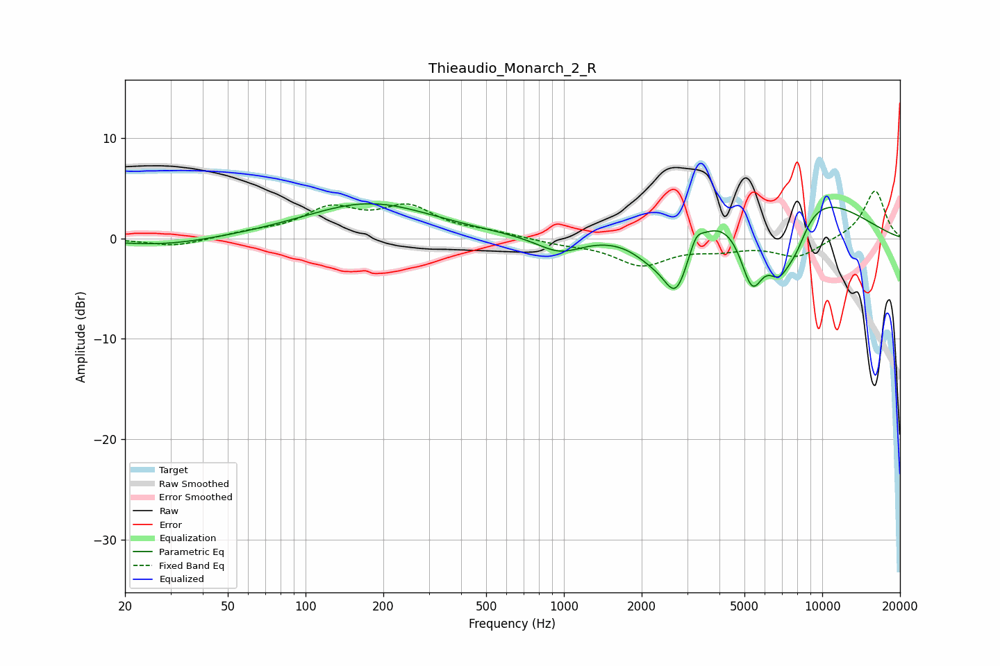

# Thieaudio_Monarch_2_R
See [usage instructions](https://github.com/jaakkopasanen/AutoEq#usage) for more options and info.

### Parametric EQs
Apply preamp of -3.6 dB when using parametric equalizer.

|   # | Type    |   Fc (Hz) |    Q |   Gain (dB) |
|-----|---------|-----------|------|-------------|
|   1 | Peaking |        28 | 0.74 |        -0.8 |
|   2 | Peaking |       176 | 0.57 |         3.5 |
|   3 | Peaking |       964 | 1.57 |        -1.7 |
|   4 | Peaking |      2197 | 1.65 |        -2.3 |
|   5 | Peaking |      2723 | 2.75 |        -5.8 |
|   6 | Peaking |      3245 | 5.92 |         1.3 |
|   7 | Peaking |      5354 | 2.71 |        -7.6 |
|   8 | Peaking |      6749 | 0.45 |         6.2 |
|   9 | Peaking |      6790 | 2.55 |        -5.5 |
|  10 | Peaking |      7899 | 2.53 |        -3.3 |

### Fixed Band EQs
When using fixed band (also called graphic) equalizer, apply preamp of **-4.8 dB** (if available) and set gains manually with these parameters.

|   # | Type    |   Fc (Hz) |    Q |   Gain (dB) |
|-----|---------|-----------|------|-------------|
|   1 | Peaking |        31 | 1.41 |        -0.8 |
|   2 | Peaking |        62 | 1.41 |         0.5 |
|   3 | Peaking |       125 | 1.41 |         2.7 |
|   4 | Peaking |       250 | 1.41 |         2.9 |
|   5 | Peaking |       500 | 1.41 |         0.5 |
|   6 | Peaking |      1000 | 1.41 |        -0.4 |
|   7 | Peaking |      2000 | 1.41 |        -2.5 |
|   8 | Peaking |      4000 | 1.41 |        -0.8 |
|   9 | Peaking |      8000 | 1.41 |        -1.8 |
|  10 | Peaking |     16000 | 1.41 |         4.9 |

### Graphs

