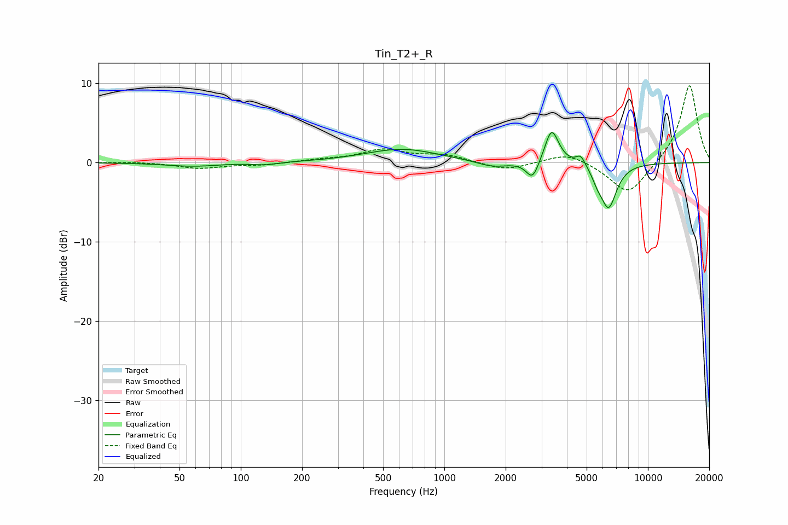

# Tin_T2+_R
See [usage instructions](https://github.com/jaakkopasanen/AutoEq#usage) for more options and info.

### Parametric EQs
Apply preamp of -3.9 dB when using parametric equalizer.

|   # | Type    |   Fc (Hz) |    Q |   Gain (dB) |
|-----|---------|-----------|------|-------------|
|   1 | Peaking |        58 | 1.11 |        -0.5 |
|   2 | Peaking |       131 | 2.3  |        -0.3 |
|   3 | Peaking |       618 | 0.78 |         1.7 |
|   4 | Peaking |      1724 | 1.81 |        -0.8 |
|   5 | Peaking |      2711 | 4.66 |        -2.3 |
|   6 | Peaking |      3352 | 4.4  |         3.8 |
|   7 | Peaking |      3493 | 3.72 |         0.7 |
|   8 | Peaking |      4676 | 6    |         1.3 |
|   9 | Peaking |      5641 | 6    |        -1   |
|  10 | Peaking |      6402 | 3.43 |        -5.6 |

### Fixed Band EQs
When using fixed band (also called graphic) equalizer, apply preamp of **-9.8 dB** (if available) and set gains manually with these parameters.

|   # | Type    |   Fc (Hz) |    Q |   Gain (dB) |
|-----|---------|-----------|------|-------------|
|   1 | Peaking |        31 | 1.41 |         0.1 |
|   2 | Peaking |        62 | 1.41 |        -0.7 |
|   3 | Peaking |       125 | 1.41 |        -0.3 |
|   4 | Peaking |       250 | 1.41 |         0.3 |
|   5 | Peaking |       500 | 1.41 |         1.5 |
|   6 | Peaking |      1000 | 1.41 |         0.9 |
|   7 | Peaking |      2000 | 1.41 |        -1   |
|   8 | Peaking |      4000 | 1.41 |         1.3 |
|   9 | Peaking |      8000 | 1.41 |        -4.2 |
|  10 | Peaking |     16000 | 1.41 |        10   |

### Graphs

