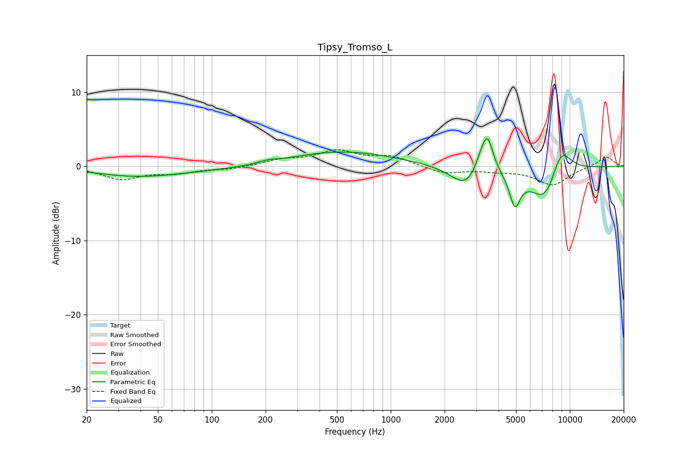

# Tipsy_Tromso_L
See [usage instructions](https://github.com/jaakkopasanen/AutoEq#usage) for more options and info.

### Parametric EQs
Apply preamp of -3.8 dB when using parametric equalizer.

|   # | Type    |   Fc (Hz) |    Q |   Gain (dB) |
|-----|---------|-----------|------|-------------|
|   1 | Peaking |        37 | 0.62 |        -1   |
|   2 | Peaking |        90 | 0.31 |        -0.5 |
|   3 | Peaking |       205 | 2.8  |         0.3 |
|   4 | Peaking |       520 | 0.46 |         2.1 |
|   5 | Peaking |      2671 | 1.68 |        -3.1 |
|   6 | Peaking |      3229 | 3.34 |         2.6 |
|   7 | Peaking |      3481 | 4.55 |         3.9 |
|   8 | Peaking |      4935 | 4.67 |        -4.3 |
|   9 | Peaking |      7387 | 1.52 |        -5.7 |
|  10 | Peaking |      8851 | 2.07 |         5   |

### Fixed Band EQs
When using fixed band (also called graphic) equalizer, apply preamp of **-2.3 dB** (if available) and set gains manually with these parameters.

|   # | Type    |   Fc (Hz) |    Q |   Gain (dB) |
|-----|---------|-----------|------|-------------|
|   1 | Peaking |        31 | 1.41 |        -1.7 |
|   2 | Peaking |        62 | 1.41 |        -0.8 |
|   3 | Peaking |       125 | 1.41 |        -0.4 |
|   4 | Peaking |       250 | 1.41 |         0.8 |
|   5 | Peaking |       500 | 1.41 |         1.9 |
|   6 | Peaking |      1000 | 1.41 |         1.2 |
|   7 | Peaking |      2000 | 1.41 |        -1   |
|   8 | Peaking |      4000 | 1.41 |        -0.5 |
|   9 | Peaking |      8000 | 1.41 |        -2.5 |
|  10 | Peaking |     16000 | 1.41 |         1.4 |

### Graphs

