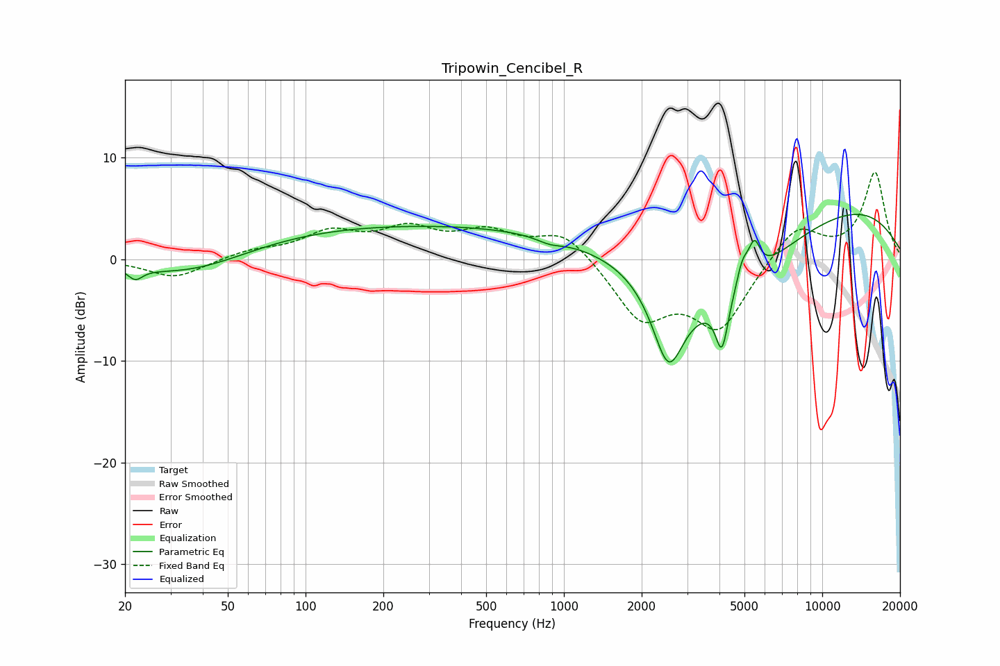

# Tripowin_Cencibel_R
See [usage instructions](https://github.com/jaakkopasanen/AutoEq#usage) for more options and info.

### Parametric EQs
Apply preamp of -4.5 dB when using parametric equalizer.

|   # | Type    |   Fc (Hz) |    Q |   Gain (dB) |
|-----|---------|-----------|------|-------------|
|   1 | Peaking |        22 | 5.12 |        -1.1 |
|   2 | Peaking |        36 | 0.62 |        -2.3 |
|   3 | Peaking |       190 | 0.22 |         3.2 |
|   4 | Peaking |       881 | 2.84 |        -0.5 |
|   5 | Peaking |      2538 | 2.26 |        -8.3 |
|   6 | Peaking |      3883 | 0.39 |       -13.7 |
|   7 | Peaking |      4090 | 5.8  |        -5.2 |
|   8 | Peaking |      4906 | 5.99 |         2.3 |
|   9 | Peaking |      5458 | 5.97 |         3.1 |
|  10 | Peaking |      5466 | 0.19 |        11.1 |

### Fixed Band EQs
When using fixed band (also called graphic) equalizer, apply preamp of **-8.6 dB** (if available) and set gains manually with these parameters.

|   # | Type    |   Fc (Hz) |    Q |   Gain (dB) |
|-----|---------|-----------|------|-------------|
|   1 | Peaking |        31 | 1.41 |        -1.9 |
|   2 | Peaking |        62 | 1.41 |         0.8 |
|   3 | Peaking |       125 | 1.41 |         2.4 |
|   4 | Peaking |       250 | 1.41 |         2.6 |
|   5 | Peaking |       500 | 1.41 |         2.4 |
|   6 | Peaking |      1000 | 1.41 |         2.8 |
|   7 | Peaking |      2000 | 1.41 |        -5.7 |
|   8 | Peaking |      4000 | 1.41 |        -6.6 |
|   9 | Peaking |      8000 | 1.41 |         3.5 |
|  10 | Peaking |     16000 | 1.41 |         8.5 |

### Graphs

