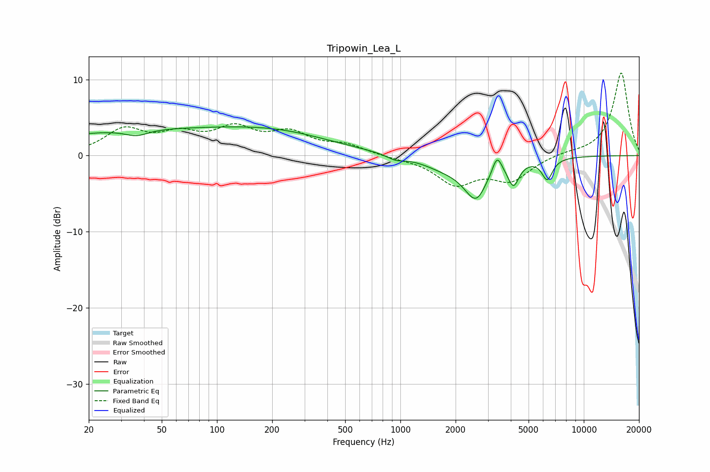

# Tripowin_Lea_L
See [usage instructions](https://github.com/jaakkopasanen/AutoEq#usage) for more options and info.

### Parametric EQs
Apply preamp of -3.9 dB when using parametric equalizer.

|   # | Type    |   Fc (Hz) |    Q |   Gain (dB) |
|-----|---------|-----------|------|-------------|
|   1 | Peaking |        36 | 2.29 |        -0.8 |
|   2 | Peaking |        45 | 0.2  |         3.3 |
|   3 | Peaking |       247 | 0.5  |         1.7 |
|   4 | Peaking |       940 | 2.96 |        -0.6 |
|   5 | Peaking |      1711 | 1.19 |        -1.2 |
|   6 | Peaking |      2624 | 2.01 |        -5.6 |
|   7 | Peaking |      2892 | 3.97 |         0.7 |
|   8 | Peaking |      3362 | 5.25 |         2.7 |
|   9 | Peaking |      4137 | 4.74 |        -3   |
|  10 | Peaking |      6321 | 4.72 |        -2.7 |

### Fixed Band EQs
When using fixed band (also called graphic) equalizer, apply preamp of **-10.9 dB** (if available) and set gains manually with these parameters.

|   # | Type    |   Fc (Hz) |    Q |   Gain (dB) |
|-----|---------|-----------|------|-------------|
|   1 | Peaking |        31 | 1.41 |         3.2 |
|   2 | Peaking |        62 | 1.41 |         2.3 |
|   3 | Peaking |       125 | 1.41 |         3.1 |
|   4 | Peaking |       250 | 1.41 |         2.6 |
|   5 | Peaking |       500 | 1.41 |         1.2 |
|   6 | Peaking |      1000 | 1.41 |        -0.2 |
|   7 | Peaking |      2000 | 1.41 |        -3.6 |
|   8 | Peaking |      4000 | 1.41 |        -3.1 |
|   9 | Peaking |      8000 | 1.41 |         0.3 |
|  10 | Peaking |     16000 | 1.41 |        10.9 |

### Graphs

