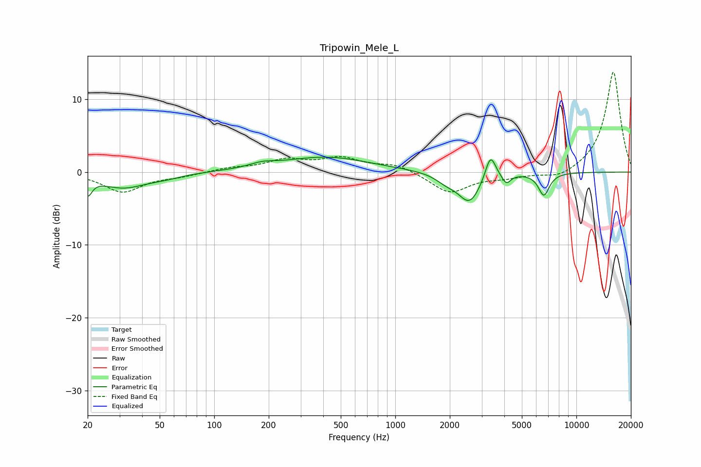

# Tripowin_Mele_L
See [usage instructions](https://github.com/jaakkopasanen/AutoEq#usage) for more options and info.

### Parametric EQs
Apply preamp of -2.1 dB when using parametric equalizer.

|   # | Type    |   Fc (Hz) |    Q |   Gain (dB) |
|-----|---------|-----------|------|-------------|
|   1 | Peaking |        20 | 5.99 |        -2.3 |
|   2 | Peaking |        31 | 1.1  |        -2.1 |
|   3 | Peaking |        54 | 1.44 |        -0.5 |
|   4 | Peaking |       185 | 2.04 |         0.6 |
|   5 | Peaking |       414 | 0.58 |         2   |
|   6 | Peaking |      1906 | 2.49 |        -0.9 |
|   7 | Peaking |      2569 | 2.25 |        -4.1 |
|   8 | Peaking |      3354 | 4.94 |         3.5 |
|   9 | Peaking |      4104 | 6    |        -1.3 |
|  10 | Peaking |      6615 | 4.49 |        -3.1 |

### Fixed Band EQs
When using fixed band (also called graphic) equalizer, apply preamp of **-13.8 dB** (if available) and set gains manually with these parameters.

|   # | Type    |   Fc (Hz) |    Q |   Gain (dB) |
|-----|---------|-----------|------|-------------|
|   1 | Peaking |        31 | 1.41 |        -2.7 |
|   2 | Peaking |        62 | 1.41 |        -0.5 |
|   3 | Peaking |       125 | 1.41 |         0.5 |
|   4 | Peaking |       250 | 1.41 |         1.5 |
|   5 | Peaking |       500 | 1.41 |         1.8 |
|   6 | Peaking |      1000 | 1.41 |         1   |
|   7 | Peaking |      2000 | 1.41 |        -2.9 |
|   8 | Peaking |      4000 | 1.41 |        -0.7 |
|   9 | Peaking |      8000 | 1.41 |        -1   |
|  10 | Peaking |     16000 | 1.41 |        13.9 |

### Graphs

