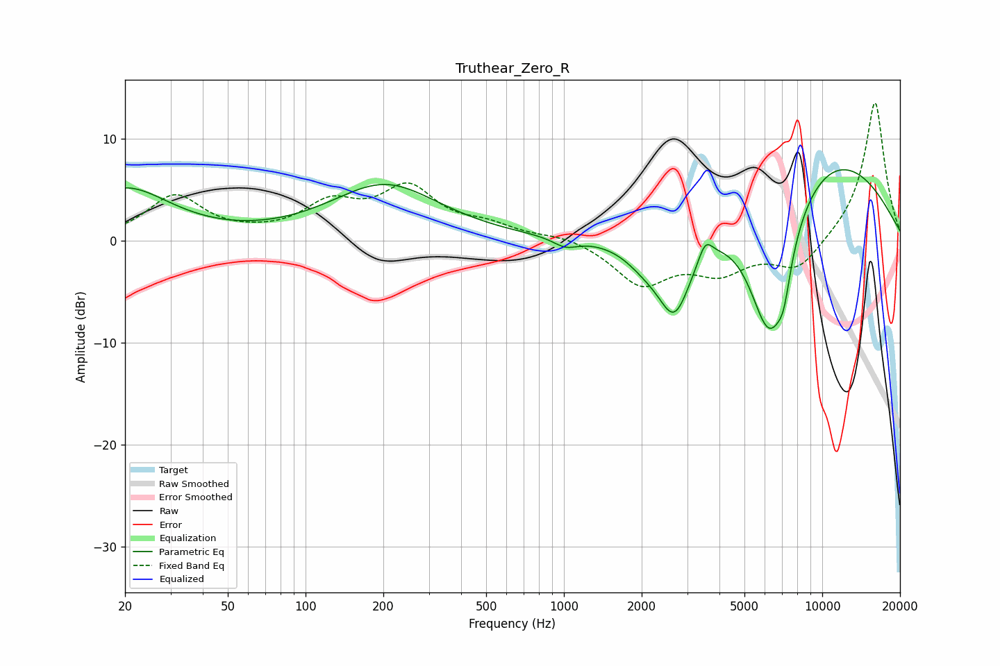

# Truthear_Zero_R
See [usage instructions](https://github.com/jaakkopasanen/AutoEq#usage) for more options and info.

### Parametric EQs
Apply preamp of -7.1 dB when using parametric equalizer.

|   # | Type    |   Fc (Hz) |    Q |   Gain (dB) |
|-----|---------|-----------|------|-------------|
|   1 | Peaking |        20 | 0.81 |         5.1 |
|   2 | Peaking |       203 | 0.67 |         5.4 |
|   3 | Peaking |      1014 | 2.95 |        -0.9 |
|   4 | Peaking |      2044 | 1.73 |        -1.7 |
|   5 | Peaking |      2681 | 2.06 |        -7.7 |
|   6 | Peaking |      3526 | 5.22 |         1.9 |
|   7 | Peaking |      6104 | 1.54 |        -9.8 |
|   8 | Peaking |      6533 | 2.04 |        -5.2 |
|   9 | Peaking |      7107 | 5.49 |        -2.4 |
|  10 | Peaking |      9889 | 0.38 |         9   |

### Fixed Band EQs
When using fixed band (also called graphic) equalizer, apply preamp of **-13.6 dB** (if available) and set gains manually with these parameters.

|   # | Type    |   Fc (Hz) |    Q |   Gain (dB) |
|-----|---------|-----------|------|-------------|
|   1 | Peaking |        31 | 1.41 |         4.3 |
|   2 | Peaking |        62 | 1.41 |         0.2 |
|   3 | Peaking |       125 | 1.41 |         3.2 |
|   4 | Peaking |       250 | 1.41 |         4.8 |
|   5 | Peaking |       500 | 1.41 |         1.2 |
|   6 | Peaking |      1000 | 1.41 |         0.6 |
|   7 | Peaking |      2000 | 1.41 |        -4.2 |
|   8 | Peaking |      4000 | 1.41 |        -2.8 |
|   9 | Peaking |      8000 | 1.41 |        -2.9 |
|  10 | Peaking |     16000 | 1.41 |        13.8 |

### Graphs

