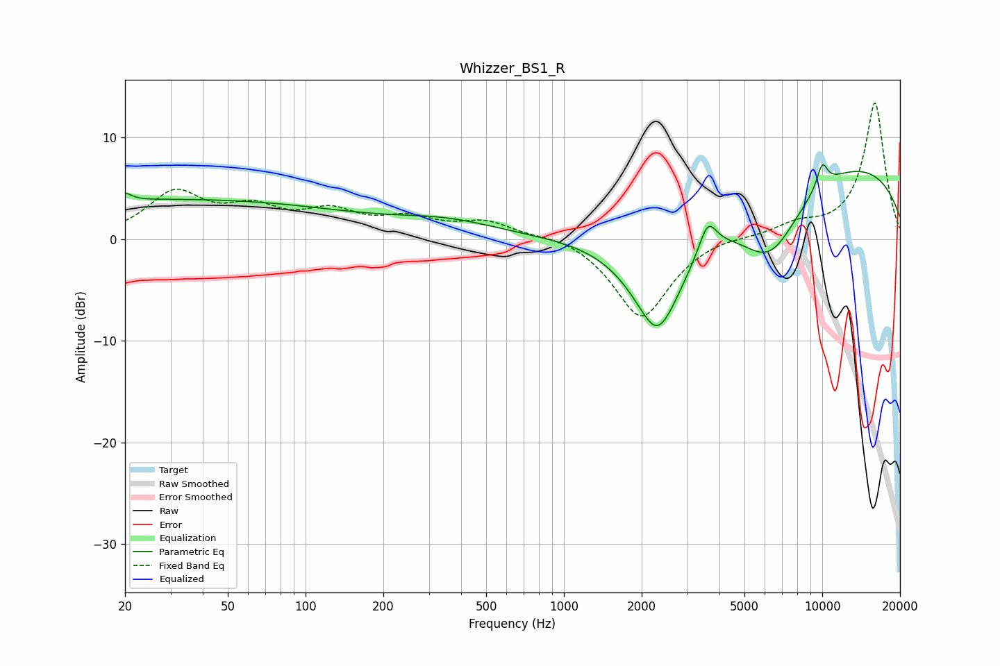

# Whizzer_BS1_R
See [usage instructions](https://github.com/jaakkopasanen/AutoEq#usage) for more options and info.

### Parametric EQs
Apply preamp of -7.4 dB when using parametric equalizer.

|   # | Type    |   Fc (Hz) |    Q |   Gain (dB) |
|-----|---------|-----------|------|-------------|
|   1 | Peaking |        20 | 5.72 |         0.7 |
|   2 | Peaking |        31 | 0.18 |         3.9 |
|   3 | Peaking |       352 | 0.69 |         1.4 |
|   4 | Peaking |      2277 | 3.53 |        -0.6 |
|   5 | Peaking |      2311 | 1.23 |       -10.7 |
|   6 | Peaking |      2479 | 2.09 |        -0.3 |
|   7 | Peaking |      3605 | 4.16 |         3   |
|   8 | Peaking |      6261 | 1.06 |        -7.6 |
|   9 | Peaking |     10000 | 5.62 |         2.3 |
|  10 | Peaking |     10000 | 0.22 |         8.1 |

### Fixed Band EQs
When using fixed band (also called graphic) equalizer, apply preamp of **-13.5 dB** (if available) and set gains manually with these parameters.

|   # | Type    |   Fc (Hz) |    Q |   Gain (dB) |
|-----|---------|-----------|------|-------------|
|   1 | Peaking |        31 | 1.41 |         4.3 |
|   2 | Peaking |        62 | 1.41 |         2.5 |
|   3 | Peaking |       125 | 1.41 |         2.3 |
|   4 | Peaking |       250 | 1.41 |         1.7 |
|   5 | Peaking |       500 | 1.41 |         1.6 |
|   6 | Peaking |      1000 | 1.41 |         0.6 |
|   7 | Peaking |      2000 | 1.41 |        -7.9 |
|   8 | Peaking |      4000 | 1.41 |         0.4 |
|   9 | Peaking |      8000 | 1.41 |         1.2 |
|  10 | Peaking |     16000 | 1.41 |        13.4 |

### Graphs

