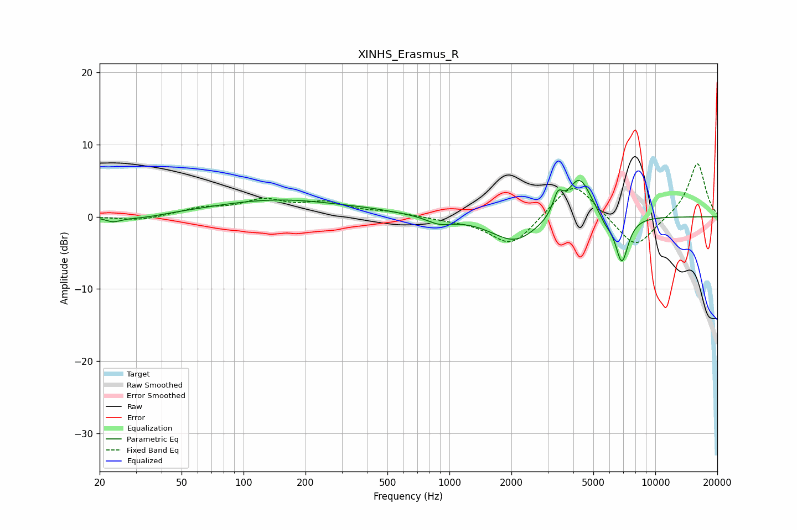

# XINHS_Erasmus_R
See [usage instructions](https://github.com/jaakkopasanen/AutoEq#usage) for more options and info.

### Parametric EQs
Apply preamp of -5.1 dB when using parametric equalizer.

|   # | Type    |   Fc (Hz) |    Q |   Gain (dB) |
|-----|---------|-----------|------|-------------|
|   1 | Peaking |        23 | 3.69 |        -0.7 |
|   2 | Peaking |        32 | 1.31 |        -0.5 |
|   3 | Peaking |       148 | 0.43 |         2.3 |
|   4 | Peaking |       422 | 1.04 |         0.3 |
|   5 | Peaking |       892 | 2.39 |        -0.9 |
|   6 | Peaking |      2082 | 1.25 |        -3.5 |
|   7 | Peaking |      3363 | 6    |         2.7 |
|   8 | Peaking |      4276 | 2.37 |         5.9 |
|   9 | Peaking |      5713 | 4.34 |        -1.1 |
|  10 | Peaking |      6876 | 4.26 |        -6.5 |

### Fixed Band EQs
When using fixed band (also called graphic) equalizer, apply preamp of **-7.4 dB** (if available) and set gains manually with these parameters.

|   # | Type    |   Fc (Hz) |    Q |   Gain (dB) |
|-----|---------|-----------|------|-------------|
|   1 | Peaking |        31 | 1.41 |        -0.6 |
|   2 | Peaking |        62 | 1.41 |         1.1 |
|   3 | Peaking |       125 | 1.41 |         2.1 |
|   4 | Peaking |       250 | 1.41 |         1.7 |
|   5 | Peaking |       500 | 1.41 |         0.6 |
|   6 | Peaking |      1000 | 1.41 |        -0.3 |
|   7 | Peaking |      2000 | 1.41 |        -4.2 |
|   8 | Peaking |      4000 | 1.41 |         5.2 |
|   9 | Peaking |      8000 | 1.41 |        -4.6 |
|  10 | Peaking |     16000 | 1.41 |         7.6 |

### Graphs

