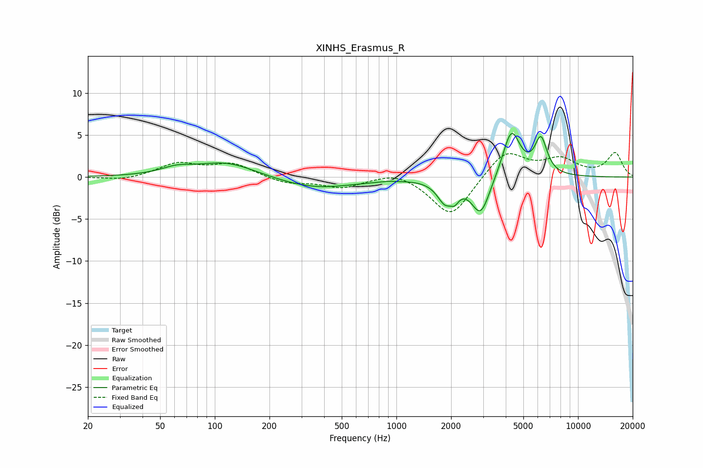

# XINHS_Erasmus_R
See [usage instructions](https://github.com/jaakkopasanen/AutoEq#usage) for more options and info.

### Parametric EQs
Apply preamp of -5.3 dB when using parametric equalizer.

|   # | Type    |   Fc (Hz) |    Q |   Gain (dB) |
|-----|---------|-----------|------|-------------|
|   1 | Peaking |        61 | 1.62 |         0.8 |
|   2 | Peaking |       116 | 0.86 |         1.8 |
|   3 | Peaking |       359 | 0.66 |        -1.4 |
|   4 | Peaking |       896 | 5.98 |         0.1 |
|   5 | Peaking |      1873 | 3.18 |        -2.8 |
|   6 | Peaking |      1989 | 4.95 |         0.6 |
|   7 | Peaking |      2082 | 5.88 |        -1.2 |
|   8 | Peaking |      2912 | 2.77 |        -4.5 |
|   9 | Peaking |      4296 | 2.92 |         5.7 |
|  10 | Peaking |      6245 | 4.09 |         4.2 |

### Fixed Band EQs
When using fixed band (also called graphic) equalizer, apply preamp of **-3.0 dB** (if available) and set gains manually with these parameters.

|   # | Type    |   Fc (Hz) |    Q |   Gain (dB) |
|-----|---------|-----------|------|-------------|
|   1 | Peaking |        31 | 1.41 |        -0.4 |
|   2 | Peaking |        62 | 1.41 |         1.6 |
|   3 | Peaking |       125 | 1.41 |         1.5 |
|   4 | Peaking |       250 | 1.41 |        -0.8 |
|   5 | Peaking |       500 | 1.41 |        -1.2 |
|   6 | Peaking |      1000 | 1.41 |         0.8 |
|   7 | Peaking |      2000 | 1.41 |        -4.8 |
|   8 | Peaking |      4000 | 1.41 |         3.2 |
|   9 | Peaking |      8000 | 1.41 |         2   |
|  10 | Peaking |     16000 | 1.41 |         2.8 |

### Graphs

