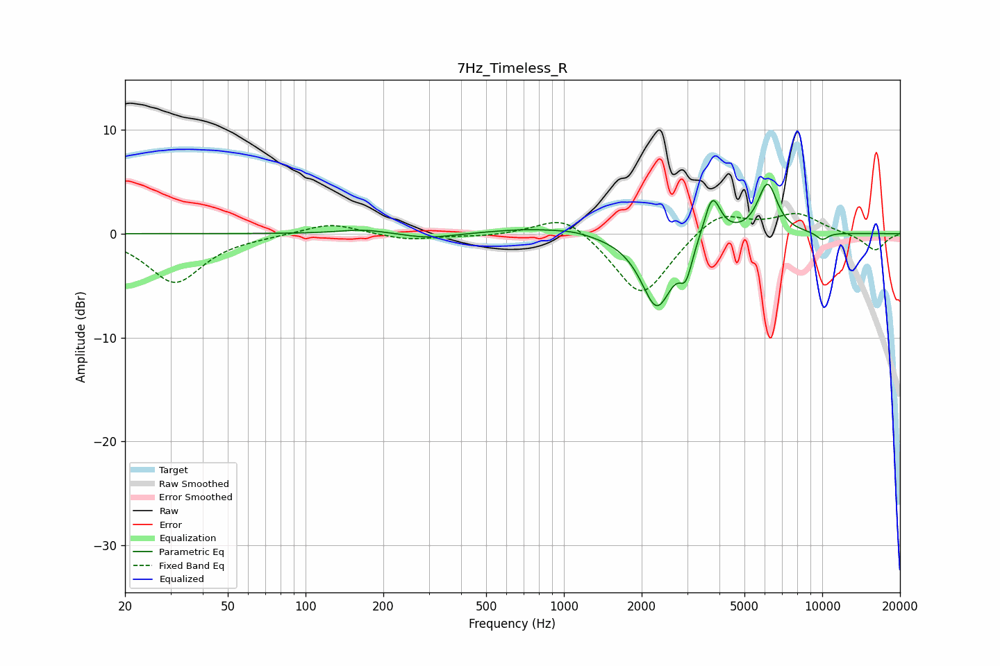

# 7Hz_Timeless_R
See [usage instructions](https://github.com/jaakkopasanen/AutoEq#usage) for more options and info.

### Parametric EQs
Apply preamp of -4.9 dB when using parametric equalizer.

|   # | Type    |   Fc (Hz) |    Q |   Gain (dB) |
|-----|---------|-----------|------|-------------|
|   1 | Peaking |       167 | 1.58 |         0.4 |
|   2 | Peaking |       298 | 1.5  |        -0.5 |
|   3 | Peaking |       743 | 0.96 |         0.5 |
|   4 | Peaking |      1093 | 1.93 |         0.3 |
|   5 | Peaking |      2290 | 2.32 |        -7   |
|   6 | Peaking |      2957 | 5.99 |        -2.2 |
|   7 | Peaking |      3011 | 6    |        -0.4 |
|   8 | Peaking |      3752 | 4.4  |         4.2 |
|   9 | Peaking |      6139 | 3.63 |         4.9 |
|  10 | Peaking |     10000 | 5.08 |        -0.7 |

### Fixed Band EQs
When using fixed band (also called graphic) equalizer, apply preamp of **-2.0 dB** (if available) and set gains manually with these parameters.

|   # | Type    |   Fc (Hz) |    Q |   Gain (dB) |
|-----|---------|-----------|------|-------------|
|   1 | Peaking |        31 | 1.41 |        -4.7 |
|   2 | Peaking |        62 | 1.41 |        -0.1 |
|   3 | Peaking |       125 | 1.41 |         1.1 |
|   4 | Peaking |       250 | 1.41 |        -0.6 |
|   5 | Peaking |       500 | 1.41 |        -0.2 |
|   6 | Peaking |      1000 | 1.41 |         2.1 |
|   7 | Peaking |      2000 | 1.41 |        -6.3 |
|   8 | Peaking |      4000 | 1.41 |         2.3 |
|   9 | Peaking |      8000 | 1.41 |         1.8 |
|  10 | Peaking |     16000 | 1.41 |        -1.6 |

### Graphs

