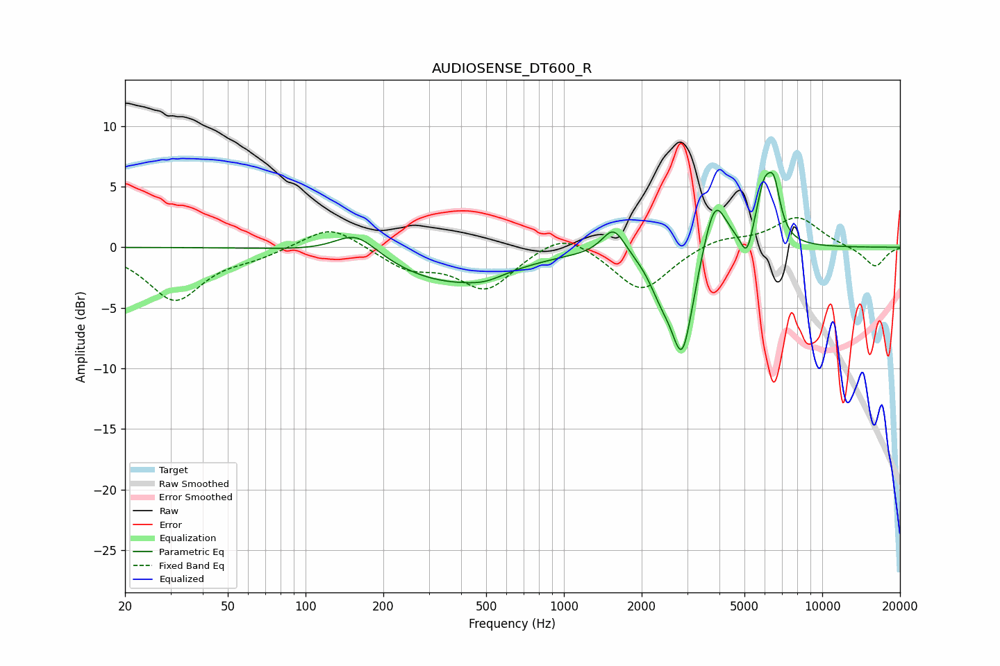

# AUDIOSENSE_DT600_R
See [usage instructions](https://github.com/jaakkopasanen/AutoEq#usage) for more options and info.

### Parametric EQs
Apply preamp of -6.3 dB when using parametric equalizer.

|   # | Type    |   Fc (Hz) |    Q |   Gain (dB) |
|-----|---------|-----------|------|-------------|
|   1 | Peaking |       157 | 1.7  |         2   |
|   2 | Peaking |       354 | 0.62 |        -2.8 |
|   3 | Peaking |       495 | 1.98 |        -0.5 |
|   4 | Peaking |      1557 | 3.21 |         2.3 |
|   5 | Peaking |      2372 | 3.03 |        -2.1 |
|   6 | Peaking |      2873 | 3.13 |        -8.8 |
|   7 | Peaking |      3832 | 3.07 |         5   |
|   8 | Peaking |      5110 | 5.98 |        -2.3 |
|   9 | Peaking |      5956 | 4.17 |         4.6 |
|  10 | Peaking |      6517 | 5.65 |         3.4 |

### Fixed Band EQs
When using fixed band (also called graphic) equalizer, apply preamp of **-2.5 dB** (if available) and set gains manually with these parameters.

|   # | Type    |   Fc (Hz) |    Q |   Gain (dB) |
|-----|---------|-----------|------|-------------|
|   1 | Peaking |        31 | 1.41 |        -4.3 |
|   2 | Peaking |        62 | 1.41 |        -0.6 |
|   3 | Peaking |       125 | 1.41 |         2   |
|   4 | Peaking |       250 | 1.41 |        -1.6 |
|   5 | Peaking |       500 | 1.41 |        -3.4 |
|   6 | Peaking |      1000 | 1.41 |         1.6 |
|   7 | Peaking |      2000 | 1.41 |        -3.7 |
|   8 | Peaking |      4000 | 1.41 |         0.8 |
|   9 | Peaking |      8000 | 1.41 |         2.5 |
|  10 | Peaking |     16000 | 1.41 |        -1.7 |

### Graphs

