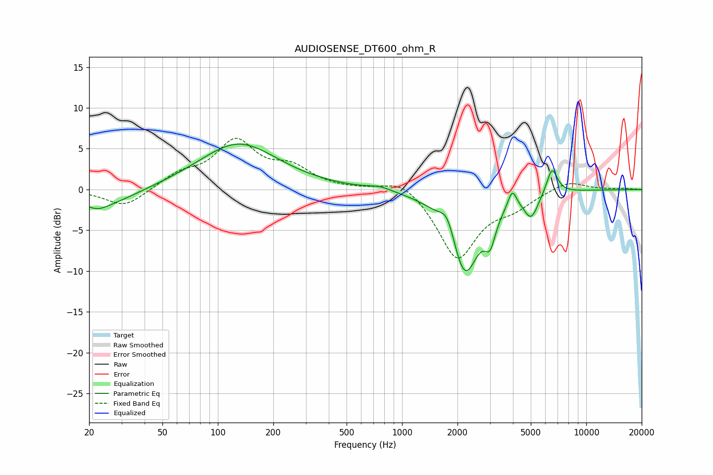

# AUDIOSENSE_DT600_ohm_R
See [usage instructions](https://github.com/jaakkopasanen/AutoEq#usage) for more options and info.

### Parametric EQs
Apply preamp of -5.7 dB when using parametric equalizer.

|   # | Type    |   Fc (Hz) |    Q |   Gain (dB) |
|-----|---------|-----------|------|-------------|
|   1 | Peaking |        22 | 2.82 |        -0.6 |
|   2 | Peaking |        23 | 0.81 |        -2.2 |
|   3 | Peaking |       129 | 0.66 |         5.7 |
|   4 | Peaking |       758 | 2.24 |         0.5 |
|   5 | Peaking |      1763 | 3.5  |         2.6 |
|   6 | Peaking |      2190 | 1.77 |       -10.4 |
|   7 | Peaking |      3007 | 4.89 |        -3.2 |
|   8 | Peaking |      3965 | 6    |         2.2 |
|   9 | Peaking |      5022 | 3.63 |        -2.9 |
|  10 | Peaking |      6516 | 4.61 |         3.2 |

### Fixed Band EQs
When using fixed band (also called graphic) equalizer, apply preamp of **-6.4 dB** (if available) and set gains manually with these parameters.

|   # | Type    |   Fc (Hz) |    Q |   Gain (dB) |
|-----|---------|-----------|------|-------------|
|   1 | Peaking |        31 | 1.41 |        -2.2 |
|   2 | Peaking |        62 | 1.41 |         1.6 |
|   3 | Peaking |       125 | 1.41 |         5.6 |
|   4 | Peaking |       250 | 1.41 |         2.3 |
|   5 | Peaking |       500 | 1.41 |         0   |
|   6 | Peaking |      1000 | 1.41 |         1.7 |
|   7 | Peaking |      2000 | 1.41 |        -8.5 |
|   8 | Peaking |      4000 | 1.41 |        -1.7 |
|   9 | Peaking |      8000 | 1.41 |         1.2 |
|  10 | Peaking |     16000 | 1.41 |         0.1 |

### Graphs

