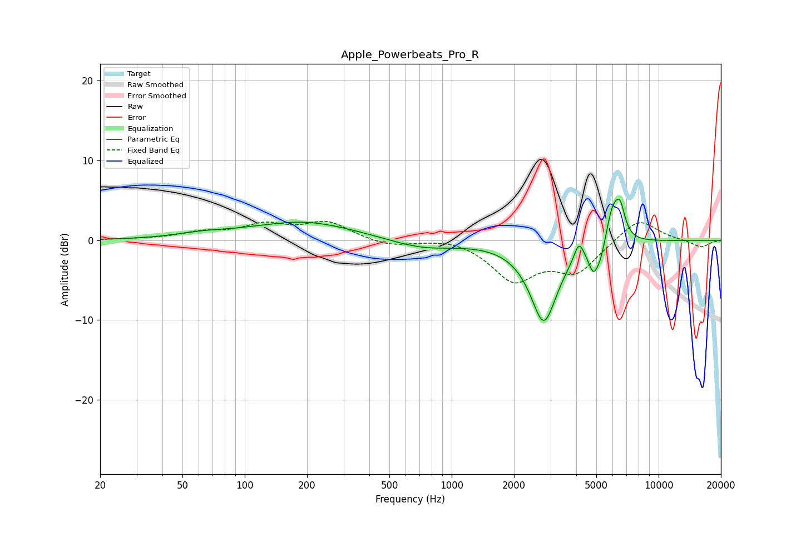

# Apple_Powerbeats_Pro_R
See [usage instructions](https://github.com/jaakkopasanen/AutoEq#usage) for more options and info.

### Parametric EQs
Apply preamp of -5.3 dB when using parametric equalizer.

|   # | Type    |   Fc (Hz) |    Q |   Gain (dB) |
|-----|---------|-----------|------|-------------|
|   1 | Peaking |        61 | 1.12 |         0.5 |
|   2 | Peaking |       138 | 2.24 |        -0.1 |
|   3 | Peaking |       189 | 0.56 |         2.3 |
|   4 | Peaking |       721 | 0.91 |        -1.1 |
|   5 | Peaking |      2788 | 2.11 |       -10.1 |
|   6 | Peaking |      4121 | 6    |         2.3 |
|   7 | Peaking |      4847 | 5.59 |        -3.1 |
|   8 | Peaking |      5265 | 6    |        -1.7 |
|   9 | Peaking |      6006 | 4.2  |         4.4 |
|  10 | Peaking |      6528 | 5.96 |         3.2 |

### Fixed Band EQs
When using fixed band (also called graphic) equalizer, apply preamp of **-2.5 dB** (if available) and set gains manually with these parameters.

|   # | Type    |   Fc (Hz) |    Q |   Gain (dB) |
|-----|---------|-----------|------|-------------|
|   1 | Peaking |        31 | 1.41 |         0.1 |
|   2 | Peaking |        62 | 1.41 |         0.9 |
|   3 | Peaking |       125 | 1.41 |         1.8 |
|   4 | Peaking |       250 | 1.41 |         2.2 |
|   5 | Peaking |       500 | 1.41 |        -0.8 |
|   6 | Peaking |      1000 | 1.41 |         0.4 |
|   7 | Peaking |      2000 | 1.41 |        -4.8 |
|   8 | Peaking |      4000 | 1.41 |        -3.8 |
|   9 | Peaking |      8000 | 1.41 |         2.9 |
|  10 | Peaking |     16000 | 1.41 |        -0.9 |

### Graphs

