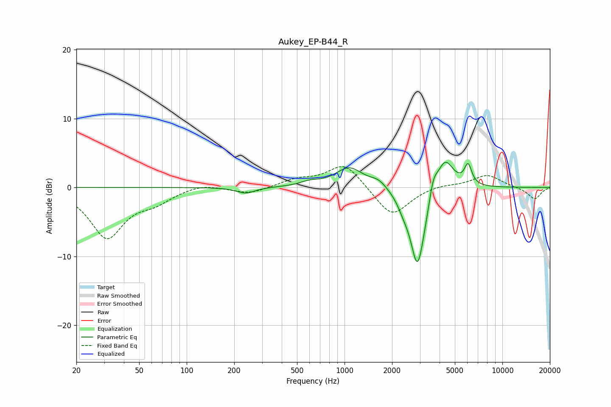

# Aukey_EP-B44_R
See [usage instructions](https://github.com/jaakkopasanen/AutoEq#usage) for more options and info.

### Parametric EQs
Apply preamp of -3.7 dB when using parametric equalizer.

|   # | Type    |   Fc (Hz) |    Q |   Gain (dB) |
|-----|---------|-----------|------|-------------|
|   1 | Peaking |       237 | 2.45 |        -0.9 |
|   2 | Peaking |       602 | 2.34 |         0.6 |
|   3 | Peaking |      1072 | 1.62 |         2.9 |
|   4 | Peaking |      1645 | 2.69 |         1   |
|   5 | Peaking |      2361 | 3.75 |        -1.2 |
|   6 | Peaking |      2895 | 3.11 |       -10.5 |
|   7 | Peaking |      3118 | 2.3  |        -1.7 |
|   8 | Peaking |      3644 | 5.45 |         2.6 |
|   9 | Peaking |      4317 | 2.52 |         4.8 |
|  10 | Peaking |      6061 | 6    |         2.9 |

### Fixed Band EQs
When using fixed band (also called graphic) equalizer, apply preamp of **-3.1 dB** (if available) and set gains manually with these parameters.

|   # | Type    |   Fc (Hz) |    Q |   Gain (dB) |
|-----|---------|-----------|------|-------------|
|   1 | Peaking |        31 | 1.41 |        -7.1 |
|   2 | Peaking |        62 | 1.41 |        -1.7 |
|   3 | Peaking |       125 | 1.41 |         0.7 |
|   4 | Peaking |       250 | 1.41 |        -0.9 |
|   5 | Peaking |       500 | 1.41 |         1.1 |
|   6 | Peaking |      1000 | 1.41 |         3.6 |
|   7 | Peaking |      2000 | 1.41 |        -4.4 |
|   8 | Peaking |      4000 | 1.41 |         0.4 |
|   9 | Peaking |      8000 | 1.41 |         1.8 |
|  10 | Peaking |     16000 | 1.41 |        -1.7 |

### Graphs

