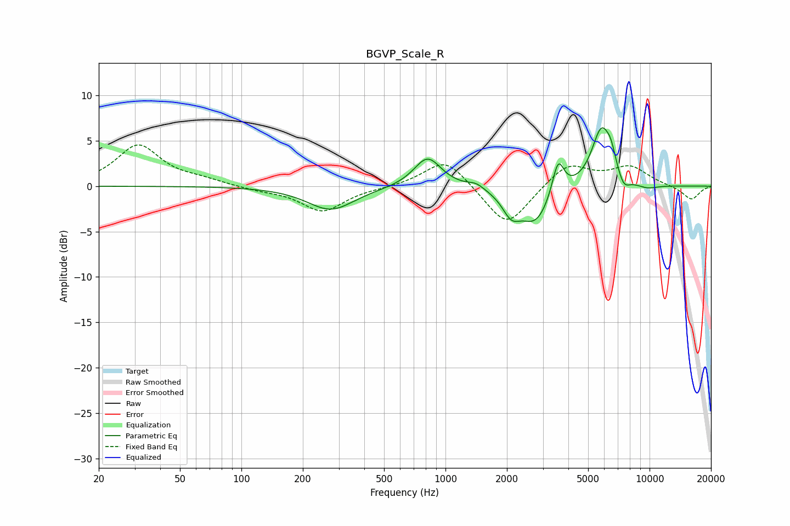

# BGVP_Scale_R
See [usage instructions](https://github.com/jaakkopasanen/AutoEq#usage) for more options and info.

### Parametric EQs
Apply preamp of -6.5 dB when using parametric equalizer.

|   # | Type    |   Fc (Hz) |    Q |   Gain (dB) |
|-----|---------|-----------|------|-------------|
|   1 | Peaking |       274 | 1.23 |        -2.6 |
|   2 | Peaking |       817 | 2.13 |         3.3 |
|   3 | Peaking |      1412 | 3.69 |         0.5 |
|   4 | Peaking |      2100 | 3.23 |        -2.2 |
|   5 | Peaking |      2767 | 1.84 |        -4   |
|   6 | Peaking |      3563 | 4.83 |         3.9 |
|   7 | Peaking |      5816 | 2.81 |         6.4 |
|   8 | Peaking |      6475 | 6    |         1.5 |
|   9 | Peaking |      7472 | 4.56 |        -1.4 |
|  10 | Peaking |      9718 | 2.32 |        -0.5 |

### Fixed Band EQs
When using fixed band (also called graphic) equalizer, apply preamp of **-4.6 dB** (if available) and set gains manually with these parameters.

|   # | Type    |   Fc (Hz) |    Q |   Gain (dB) |
|-----|---------|-----------|------|-------------|
|   1 | Peaking |        31 | 1.41 |         4.5 |
|   2 | Peaking |        62 | 1.41 |         0.6 |
|   3 | Peaking |       125 | 1.41 |        -0.4 |
|   4 | Peaking |       250 | 1.41 |        -2.8 |
|   5 | Peaking |       500 | 1.41 |        -0.1 |
|   6 | Peaking |      1000 | 1.41 |         3.2 |
|   7 | Peaking |      2000 | 1.41 |        -4.7 |
|   8 | Peaking |      4000 | 1.41 |         2.6 |
|   9 | Peaking |      8000 | 1.41 |         2.1 |
|  10 | Peaking |     16000 | 1.41 |        -1.5 |

### Graphs

