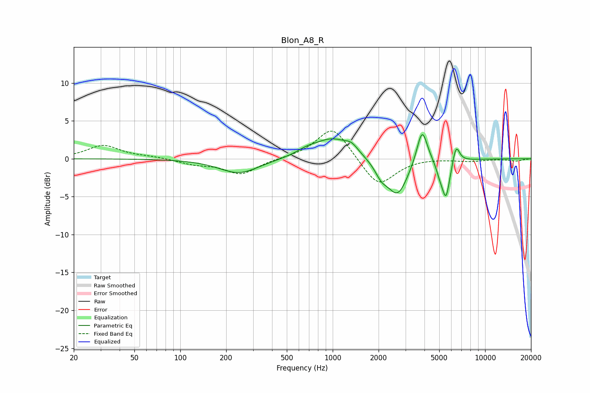

# Blon_A8_R
See [usage instructions](https://github.com/jaakkopasanen/AutoEq#usage) for more options and info.

### Parametric EQs
Apply preamp of -3.3 dB when using parametric equalizer.

|   # | Type    |   Fc (Hz) |    Q |   Gain (dB) |
|-----|---------|-----------|------|-------------|
|   1 | Peaking |       243 | 1.09 |        -1.9 |
|   2 | Peaking |       674 | 2.01 |         0.6 |
|   3 | Peaking |       993 | 1.19 |         2.6 |
|   4 | Peaking |      1329 | 3.24 |         0.9 |
|   5 | Peaking |      2086 | 3.32 |        -1.6 |
|   6 | Peaking |      2668 | 2.08 |        -4.8 |
|   7 | Peaking |      3862 | 4.02 |         4.8 |
|   8 | Peaking |      5040 | 5.83 |        -1.2 |
|   9 | Peaking |      5538 | 5.26 |        -5   |
|  10 | Peaking |      6450 | 6    |         2.5 |

### Fixed Band EQs
When using fixed band (also called graphic) equalizer, apply preamp of **-3.7 dB** (if available) and set gains manually with these parameters.

|   # | Type    |   Fc (Hz) |    Q |   Gain (dB) |
|-----|---------|-----------|------|-------------|
|   1 | Peaking |        31 | 1.41 |         1.8 |
|   2 | Peaking |        62 | 1.41 |         0.2 |
|   3 | Peaking |       125 | 1.41 |        -0.6 |
|   4 | Peaking |       250 | 1.41 |        -2   |
|   5 | Peaking |       500 | 1.41 |         0.1 |
|   6 | Peaking |      1000 | 1.41 |         4.4 |
|   7 | Peaking |      2000 | 1.41 |        -3.8 |
|   8 | Peaking |      4000 | 1.41 |         0.1 |
|   9 | Peaking |      8000 | 1.41 |        -0.3 |
|  10 | Peaking |     16000 | 1.41 |        -0.3 |

### Graphs

