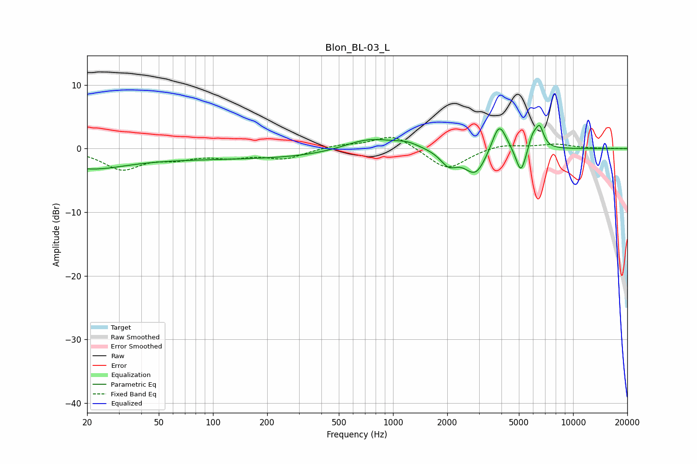

# Blon_BL-03_L
See [usage instructions](https://github.com/jaakkopasanen/AutoEq#usage) for more options and info.

### Parametric EQs
Apply preamp of -3.8 dB when using parametric equalizer.

|   # | Type    |   Fc (Hz) |    Q |   Gain (dB) |
|-----|---------|-----------|------|-------------|
|   1 | Peaking |        20 | 0.69 |        -2.6 |
|   2 | Peaking |       156 | 0.18 |        -1.6 |
|   3 | Peaking |       737 | 0.93 |         2.3 |
|   4 | Peaking |      1203 | 2.17 |         0.7 |
|   5 | Peaking |      2039 | 3.04 |        -2.2 |
|   6 | Peaking |      2872 | 2.32 |        -4.1 |
|   7 | Peaking |      3885 | 3.49 |         4.8 |
|   8 | Peaking |      5129 | 5.04 |        -4.2 |
|   9 | Peaking |      5969 | 5.87 |         2   |
|  10 | Peaking |      6518 | 5.96 |         3.2 |

### Fixed Band EQs
When using fixed band (also called graphic) equalizer, apply preamp of **-1.9 dB** (if available) and set gains manually with these parameters.

|   # | Type    |   Fc (Hz) |    Q |   Gain (dB) |
|-----|---------|-----------|------|-------------|
|   1 | Peaking |        31 | 1.41 |        -3.1 |
|   2 | Peaking |        62 | 1.41 |        -1.2 |
|   3 | Peaking |       125 | 1.41 |        -1.1 |
|   4 | Peaking |       250 | 1.41 |        -1.5 |
|   5 | Peaking |       500 | 1.41 |         0.5 |
|   6 | Peaking |      1000 | 1.41 |         2.3 |
|   7 | Peaking |      2000 | 1.41 |        -3.4 |
|   8 | Peaking |      4000 | 1.41 |         0.8 |
|   9 | Peaking |      8000 | 1.41 |         0.7 |
|  10 | Peaking |     16000 | 1.41 |         0   |

### Graphs

