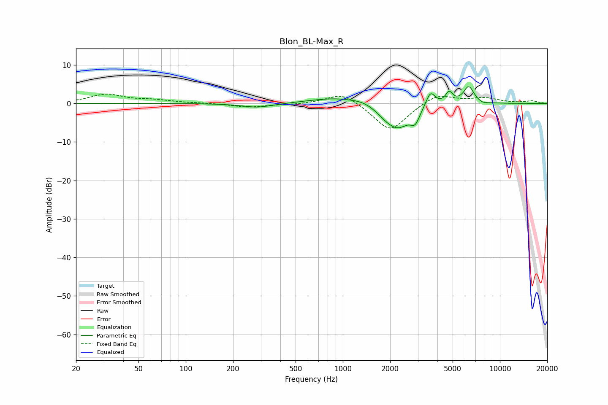

# Blon_BL-Max_R
See [usage instructions](https://github.com/jaakkopasanen/AutoEq#usage) for more options and info.

### Parametric EQs
Apply preamp of -4.5 dB when using parametric equalizer.

|   # | Type    |   Fc (Hz) |    Q |   Gain (dB) |
|-----|---------|-----------|------|-------------|
|   1 | Peaking |       286 | 1.43 |        -1.1 |
|   2 | Peaking |       923 | 0.85 |         1.6 |
|   3 | Peaking |      1338 | 2.31 |         0.6 |
|   4 | Peaking |      1846 | 2.98 |        -1   |
|   5 | Peaking |      2231 | 1.76 |        -6.2 |
|   6 | Peaking |      2886 | 4.89 |        -3.2 |
|   7 | Peaking |      3613 | 4.81 |         4   |
|   8 | Peaking |      4754 | 5.95 |         2.9 |
|   9 | Peaking |      6329 | 4.1  |         4.4 |
|  10 | Peaking |      7782 | 4.71 |        -0.4 |

### Fixed Band EQs
When using fixed band (also called graphic) equalizer, apply preamp of **-2.5 dB** (if available) and set gains manually with these parameters.

|   # | Type    |   Fc (Hz) |    Q |   Gain (dB) |
|-----|---------|-----------|------|-------------|
|   1 | Peaking |        31 | 1.41 |         2.3 |
|   2 | Peaking |        62 | 1.41 |         0.8 |
|   3 | Peaking |       125 | 1.41 |         0.1 |
|   4 | Peaking |       250 | 1.41 |        -1   |
|   5 | Peaking |       500 | 1.41 |        -0.3 |
|   6 | Peaking |      1000 | 1.41 |         3.1 |
|   7 | Peaking |      2000 | 1.41 |        -7.4 |
|   8 | Peaking |      4000 | 1.41 |         2.8 |
|   9 | Peaking |      8000 | 1.41 |         1.3 |
|  10 | Peaking |     16000 | 1.41 |         0.6 |

### Graphs

