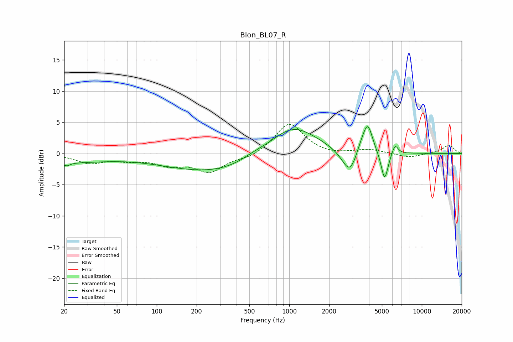

# Blon_BL07_R
See [usage instructions](https://github.com/jaakkopasanen/AutoEq#usage) for more options and info.

### Parametric EQs
Apply preamp of -4.4 dB when using parametric equalizer.

|   # | Type    |   Fc (Hz) |    Q |   Gain (dB) |
|-----|---------|-----------|------|-------------|
|   1 | Peaking |        21 | 0.46 |        -1.3 |
|   2 | Peaking |        21 | 5.9  |        -0.5 |
|   3 | Peaking |       317 | 0.33 |        -3.3 |
|   4 | Peaking |       529 | 1.39 |         0.7 |
|   5 | Peaking |      1048 | 0.75 |         5.4 |
|   6 | Peaking |      2871 | 2.37 |        -4.3 |
|   7 | Peaking |      3493 | 3.03 |         1.7 |
|   8 | Peaking |      3918 | 3.91 |         4.3 |
|   9 | Peaking |      5241 | 5.24 |        -4.7 |
|  10 | Peaking |      6275 | 6    |         1.7 |

### Fixed Band EQs
When using fixed band (also called graphic) equalizer, apply preamp of **-4.8 dB** (if available) and set gains manually with these parameters.

|   # | Type    |   Fc (Hz) |    Q |   Gain (dB) |
|-----|---------|-----------|------|-------------|
|   1 | Peaking |        31 | 1.41 |        -1.4 |
|   2 | Peaking |        62 | 1.41 |        -0.8 |
|   3 | Peaking |       125 | 1.41 |        -1.6 |
|   4 | Peaking |       250 | 1.41 |        -2.8 |
|   5 | Peaking |       500 | 1.41 |        -0.7 |
|   6 | Peaking |      1000 | 1.41 |         5   |
|   7 | Peaking |      2000 | 1.41 |        -0.3 |
|   8 | Peaking |      4000 | 1.41 |         0.6 |
|   9 | Peaking |      8000 | 1.41 |        -0.7 |
|  10 | Peaking |     16000 | 1.41 |         1.4 |

### Graphs

