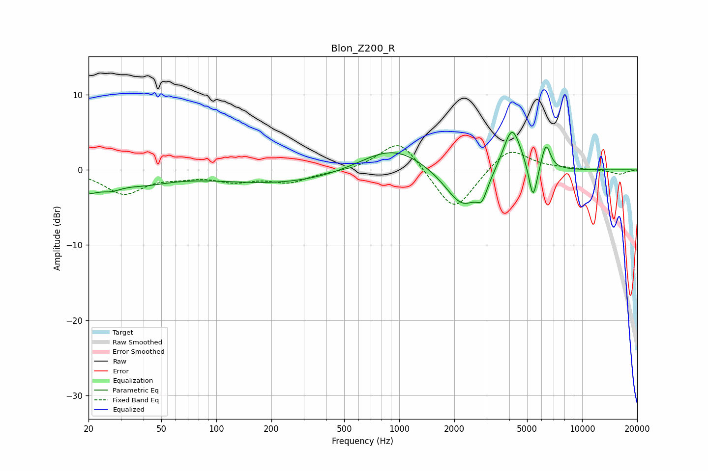

# Blon_Z200_R
See [usage instructions](https://github.com/jaakkopasanen/AutoEq#usage) for more options and info.

### Parametric EQs
Apply preamp of -5.1 dB when using parametric equalizer.

|   # | Type    |   Fc (Hz) |    Q |   Gain (dB) |
|-----|---------|-----------|------|-------------|
|   1 | Peaking |        20 | 2.74 |        -2   |
|   2 | Peaking |        26 | 2.16 |        -1.3 |
|   3 | Peaking |        40 | 0.94 |        -1.4 |
|   4 | Peaking |       231 | 0.37 |        -1.8 |
|   5 | Peaking |       920 | 0.78 |         3.5 |
|   6 | Peaking |      2229 | 1.44 |        -5.4 |
|   7 | Peaking |      2835 | 4.96 |        -2.2 |
|   8 | Peaking |      4135 | 2.78 |         6.3 |
|   9 | Peaking |      5389 | 6    |        -5.1 |
|  10 | Peaking |      6342 | 5.61 |         3.4 |

### Fixed Band EQs
When using fixed band (also called graphic) equalizer, apply preamp of **-3.3 dB** (if available) and set gains manually with these parameters.

|   # | Type    |   Fc (Hz) |    Q |   Gain (dB) |
|-----|---------|-----------|------|-------------|
|   1 | Peaking |        31 | 1.41 |        -3.1 |
|   2 | Peaking |        62 | 1.41 |        -0.6 |
|   3 | Peaking |       125 | 1.41 |        -1.3 |
|   4 | Peaking |       250 | 1.41 |        -1.5 |
|   5 | Peaking |       500 | 1.41 |        -0.2 |
|   6 | Peaking |      1000 | 1.41 |         4.3 |
|   7 | Peaking |      2000 | 1.41 |        -5.9 |
|   8 | Peaking |      4000 | 1.41 |         3.2 |
|   9 | Peaking |      8000 | 1.41 |         0.1 |
|  10 | Peaking |     16000 | 1.41 |        -0.6 |

### Graphs

