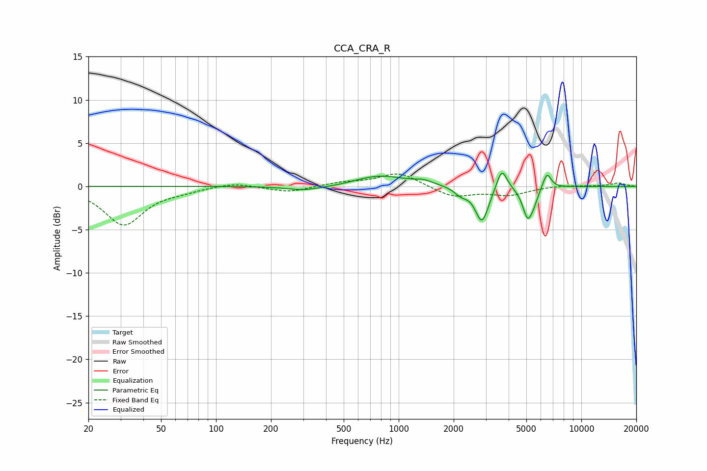

# CCA_CRA_R
See [usage instructions](https://github.com/jaakkopasanen/AutoEq#usage) for more options and info.

### Parametric EQs
Apply preamp of -1.6 dB when using parametric equalizer.

|   # | Type    |   Fc (Hz) |    Q |   Gain (dB) |
|-----|---------|-----------|------|-------------|
|   1 | Peaking |       303 | 1.5  |        -0.5 |
|   2 | Peaking |       469 | 1.29 |        -0.2 |
|   3 | Peaking |       785 | 1    |         1.3 |
|   4 | Peaking |      1369 | 2.86 |         0.4 |
|   5 | Peaking |      2195 | 3.92 |        -0.8 |
|   6 | Peaking |      2859 | 3.89 |        -4.1 |
|   7 | Peaking |      3671 | 4.98 |         2.6 |
|   8 | Peaking |      5089 | 5.06 |        -3.5 |
|   9 | Peaking |      5517 | 6    |        -0.9 |
|  10 | Peaking |      6488 | 6    |         1.8 |

### Fixed Band EQs
When using fixed band (also called graphic) equalizer, apply preamp of **-1.5 dB** (if available) and set gains manually with these parameters.

|   # | Type    |   Fc (Hz) |    Q |   Gain (dB) |
|-----|---------|-----------|------|-------------|
|   1 | Peaking |        31 | 1.41 |        -4.4 |
|   2 | Peaking |        62 | 1.41 |        -0.4 |
|   3 | Peaking |       125 | 1.41 |         0.5 |
|   4 | Peaking |       250 | 1.41 |        -0.7 |
|   5 | Peaking |       500 | 1.41 |         0.4 |
|   6 | Peaking |      1000 | 1.41 |         1.6 |
|   7 | Peaking |      2000 | 1.41 |        -1.2 |
|   8 | Peaking |      4000 | 1.41 |        -0.9 |
|   9 | Peaking |      8000 | 1.41 |         0.1 |
|  10 | Peaking |     16000 | 1.41 |         0.4 |

### Graphs

