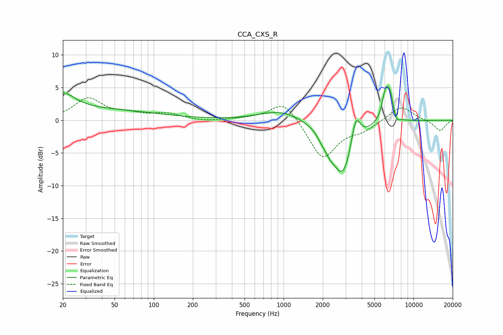

# CCA_CXS_R
See [usage instructions](https://github.com/jaakkopasanen/AutoEq#usage) for more options and info.

### Parametric EQs
Apply preamp of -5.3 dB when using parametric equalizer.

|   # | Type    |   Fc (Hz) |    Q |   Gain (dB) |
|-----|---------|-----------|------|-------------|
|   1 | Peaking |        20 | 1.58 |         2.5 |
|   2 | Peaking |        27 | 0.22 |         1.7 |
|   3 | Peaking |       946 | 0.92 |         1.6 |
|   4 | Peaking |      1935 | 4.94 |        -0.5 |
|   5 | Peaking |      2240 | 3.22 |        -1.6 |
|   6 | Peaking |      2858 | 1.73 |        -8.4 |
|   7 | Peaking |      3587 | 4.19 |         4.6 |
|   8 | Peaking |      6044 | 5.45 |         3.4 |
|   9 | Peaking |      6553 | 4.73 |         4   |
|  10 | Peaking |      7375 | 5.96 |        -1.1 |

### Fixed Band EQs
When using fixed band (also called graphic) equalizer, apply preamp of **-3.5 dB** (if available) and set gains manually with these parameters.

|   # | Type    |   Fc (Hz) |    Q |   Gain (dB) |
|-----|---------|-----------|------|-------------|
|   1 | Peaking |        31 | 1.41 |         3.3 |
|   2 | Peaking |        62 | 1.41 |         0.8 |
|   3 | Peaking |       125 | 1.41 |         0.9 |
|   4 | Peaking |       250 | 1.41 |        -0.2 |
|   5 | Peaking |       500 | 1.41 |         0.2 |
|   6 | Peaking |      1000 | 1.41 |         3.2 |
|   7 | Peaking |      2000 | 1.41 |        -6   |
|   8 | Peaking |      4000 | 1.41 |        -1.3 |
|   9 | Peaking |      8000 | 1.41 |         2.3 |
|  10 | Peaking |     16000 | 1.41 |        -1.6 |

### Graphs

