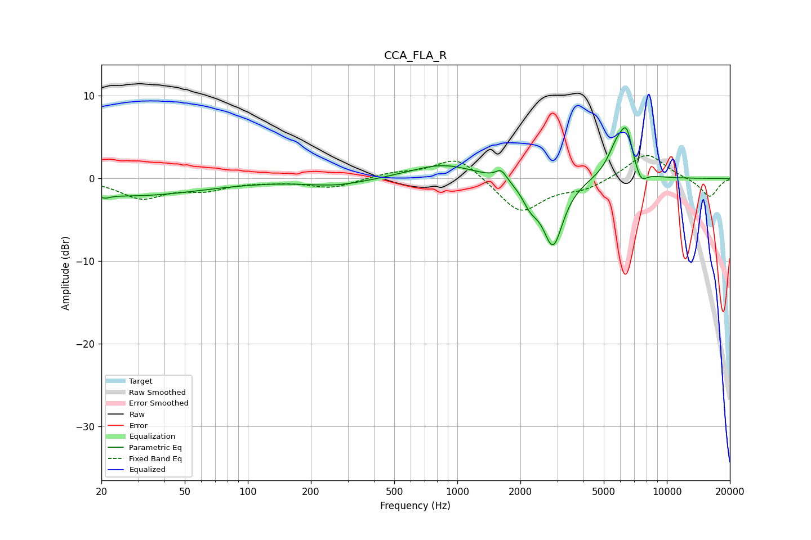

# CCA_FLA_R
See [usage instructions](https://github.com/jaakkopasanen/AutoEq#usage) for more options and info.

### Parametric EQs
Apply preamp of -6.2 dB when using parametric equalizer.

|   # | Type    |   Fc (Hz) |    Q |   Gain (dB) |
|-----|---------|-----------|------|-------------|
|   1 | Peaking |        21 | 5.93 |        -0.4 |
|   2 | Peaking |        27 | 0.4  |        -2.1 |
|   3 | Peaking |       266 | 0.94 |        -0.8 |
|   4 | Peaking |       853 | 0.92 |         1.8 |
|   5 | Peaking |      1619 | 5.49 |         1.2 |
|   6 | Peaking |      2236 | 3.57 |        -2.1 |
|   7 | Peaking |      2863 | 2.85 |        -8   |
|   8 | Peaking |      5840 | 2.88 |         4   |
|   9 | Peaking |      6446 | 4.94 |         3.8 |
|  10 | Peaking |      7522 | 4.93 |        -1.6 |

### Fixed Band EQs
When using fixed band (also called graphic) equalizer, apply preamp of **-2.9 dB** (if available) and set gains manually with these parameters.

|   # | Type    |   Fc (Hz) |    Q |   Gain (dB) |
|-----|---------|-----------|------|-------------|
|   1 | Peaking |        31 | 1.41 |        -2.3 |
|   2 | Peaking |        62 | 1.41 |        -1.2 |
|   3 | Peaking |       125 | 1.41 |        -0.2 |
|   4 | Peaking |       250 | 1.41 |        -1.1 |
|   5 | Peaking |       500 | 1.41 |         0.6 |
|   6 | Peaking |      1000 | 1.41 |         2.8 |
|   7 | Peaking |      2000 | 1.41 |        -4.2 |
|   8 | Peaking |      4000 | 1.41 |        -1.2 |
|   9 | Peaking |      8000 | 1.41 |         3.2 |
|  10 | Peaking |     16000 | 1.41 |        -2.3 |

### Graphs

