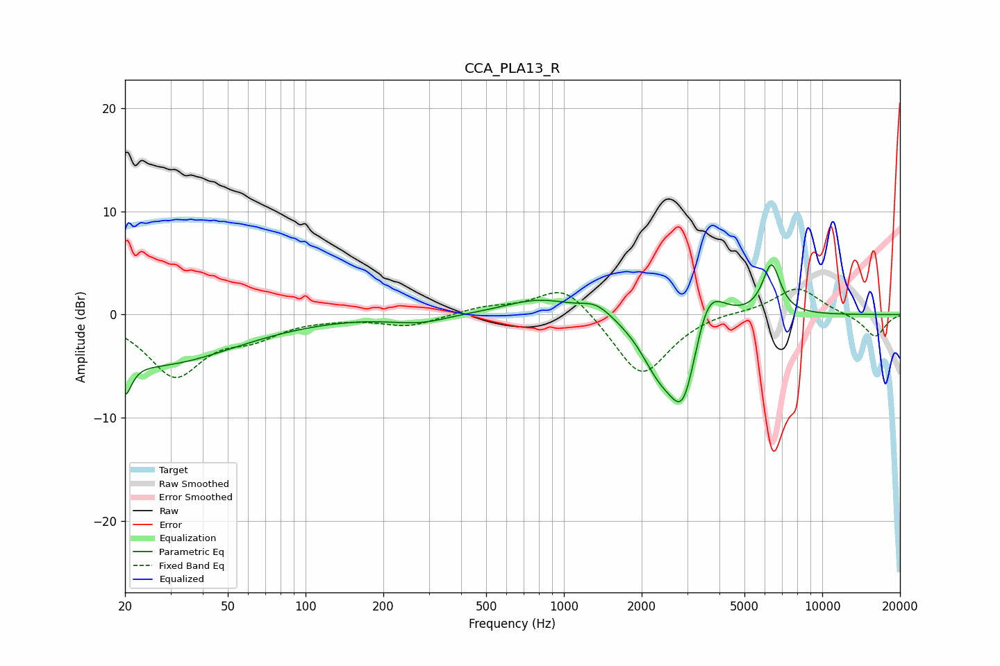

# CCA_PLA13_R
See [usage instructions](https://github.com/jaakkopasanen/AutoEq#usage) for more options and info.

### Parametric EQs
Apply preamp of -4.9 dB when using parametric equalizer.

|   # | Type    |   Fc (Hz) |    Q |   Gain (dB) |
|-----|---------|-----------|------|-------------|
|   1 | Peaking |        20 | 5.7  |        -3.2 |
|   2 | Peaking |        26 | 0.46 |        -4.8 |
|   3 | Peaking |       224 | 2.05 |        -0.1 |
|   4 | Peaking |       286 | 1.46 |        -0.7 |
|   5 | Peaking |       805 | 1.04 |         1.6 |
|   6 | Peaking |      1336 | 2.32 |         1.2 |
|   7 | Peaking |      2315 | 1.99 |        -3.6 |
|   8 | Peaking |      2908 | 2.26 |        -9.2 |
|   9 | Peaking |      3583 | 2.22 |         5.5 |
|  10 | Peaking |      6362 | 3.95 |         4.9 |

### Fixed Band EQs
When using fixed band (also called graphic) equalizer, apply preamp of **-2.6 dB** (if available) and set gains manually with these parameters.

|   # | Type    |   Fc (Hz) |    Q |   Gain (dB) |
|-----|---------|-----------|------|-------------|
|   1 | Peaking |        31 | 1.41 |        -5.8 |
|   2 | Peaking |        62 | 1.41 |        -1.7 |
|   3 | Peaking |       125 | 1.41 |        -0.2 |
|   4 | Peaking |       250 | 1.41 |        -1.1 |
|   5 | Peaking |       500 | 1.41 |         0.7 |
|   6 | Peaking |      1000 | 1.41 |         3.1 |
|   7 | Peaking |      2000 | 1.41 |        -6.2 |
|   8 | Peaking |      4000 | 1.41 |         0.3 |
|   9 | Peaking |      8000 | 1.41 |         2.7 |
|  10 | Peaking |     16000 | 1.41 |        -2.2 |

### Graphs

