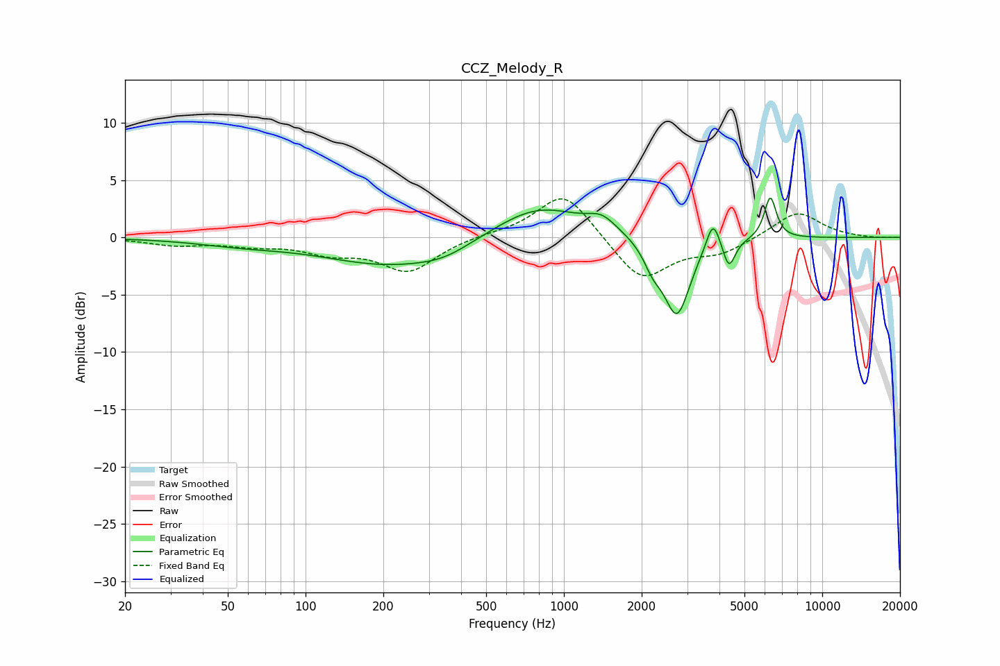

# CCZ_Melody_R
See [usage instructions](https://github.com/jaakkopasanen/AutoEq#usage) for more options and info.

### Parametric EQs
Apply preamp of -3.5 dB when using parametric equalizer.

|   # | Type    |   Fc (Hz) |    Q |   Gain (dB) |
|-----|---------|-----------|------|-------------|
|   1 | Peaking |        56 | 0.83 |        -0.5 |
|   2 | Peaking |       218 | 0.54 |        -2.4 |
|   3 | Peaking |       345 | 1.41 |        -0.7 |
|   4 | Peaking |       791 | 0.8  |         3   |
|   5 | Peaking |      1403 | 2.57 |         1.1 |
|   6 | Peaking |      2211 | 3.91 |        -1.6 |
|   7 | Peaking |      2739 | 2.76 |        -6.8 |
|   8 | Peaking |      3778 | 5.33 |         2.7 |
|   9 | Peaking |      4354 | 6    |        -2.5 |
|  10 | Peaking |      6293 | 5.96 |         3.7 |

### Fixed Band EQs
When using fixed band (also called graphic) equalizer, apply preamp of **-3.5 dB** (if available) and set gains manually with these parameters.

|   # | Type    |   Fc (Hz) |    Q |   Gain (dB) |
|-----|---------|-----------|------|-------------|
|   1 | Peaking |        31 | 1.41 |        -0.6 |
|   2 | Peaking |        62 | 1.41 |        -0.6 |
|   3 | Peaking |       125 | 1.41 |        -1.1 |
|   4 | Peaking |       250 | 1.41 |        -2.9 |
|   5 | Peaking |       500 | 1.41 |         0.2 |
|   6 | Peaking |      1000 | 1.41 |         4.1 |
|   7 | Peaking |      2000 | 1.41 |        -3.9 |
|   8 | Peaking |      4000 | 1.41 |        -1.3 |
|   9 | Peaking |      8000 | 1.41 |         2.3 |
|  10 | Peaking |     16000 | 1.41 |        -0.1 |

### Graphs

