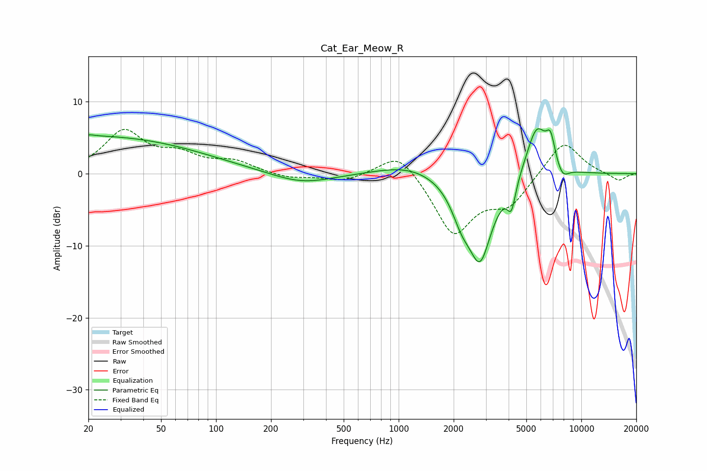

# Cat_Ear_Meow_R
See [usage instructions](https://github.com/jaakkopasanen/AutoEq#usage) for more options and info.

### Parametric EQs
Apply preamp of -6.3 dB when using parametric equalizer.

|   # | Type    |   Fc (Hz) |    Q |   Gain (dB) |
|-----|---------|-----------|------|-------------|
|   1 | Peaking |        20 | 0.22 |         5.2 |
|   2 | Peaking |        20 | 5.42 |         0.2 |
|   3 | Peaking |       295 | 0.83 |        -1.6 |
|   4 | Peaking |      1146 | 0.82 |         1.4 |
|   5 | Peaking |      2211 | 2.6  |        -3.4 |
|   6 | Peaking |      2791 | 2.02 |       -11.5 |
|   7 | Peaking |      4144 | 5.99 |        -3.7 |
|   8 | Peaking |      5697 | 2.38 |         7   |
|   9 | Peaking |      6788 | 5.47 |         3.5 |
|  10 | Peaking |      7875 | 3.91 |        -1.7 |

### Fixed Band EQs
When using fixed band (also called graphic) equalizer, apply preamp of **-6.2 dB** (if available) and set gains manually with these parameters.

|   # | Type    |   Fc (Hz) |    Q |   Gain (dB) |
|-----|---------|-----------|------|-------------|
|   1 | Peaking |        31 | 1.41 |         5.7 |
|   2 | Peaking |        62 | 1.41 |         2.2 |
|   3 | Peaking |       125 | 1.41 |         1.5 |
|   4 | Peaking |       250 | 1.41 |        -0.7 |
|   5 | Peaking |       500 | 1.41 |        -1   |
|   6 | Peaking |      1000 | 1.41 |         3.5 |
|   7 | Peaking |      2000 | 1.41 |        -8.3 |
|   8 | Peaking |      4000 | 1.41 |        -3.9 |
|   9 | Peaking |      8000 | 1.41 |         4.8 |
|  10 | Peaking |     16000 | 1.41 |        -1.1 |

### Graphs

