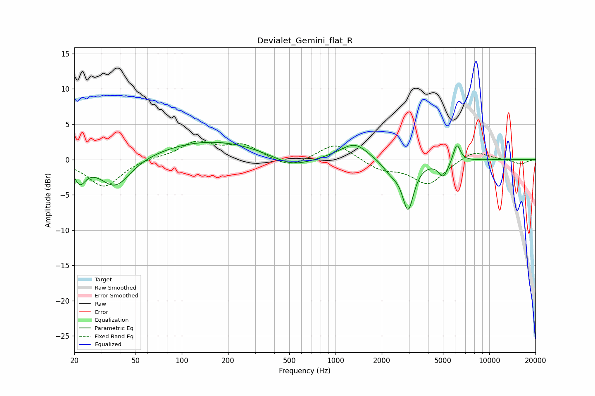

# Devialet_Gemini_flat_R
See [usage instructions](https://github.com/jaakkopasanen/AutoEq#usage) for more options and info.

### Parametric EQs
Apply preamp of -2.5 dB when using parametric equalizer.

|   # | Type    |   Fc (Hz) |    Q |   Gain (dB) |
|-----|---------|-----------|------|-------------|
|   1 | Peaking |        22 | 3.92 |        -2.7 |
|   2 | Peaking |        37 | 1.43 |        -4.2 |
|   3 | Peaking |       155 | 0.42 |         2.7 |
|   4 | Peaking |       518 | 1.08 |        -1.6 |
|   5 | Peaking |      1086 | 1.55 |         0.4 |
|   6 | Peaking |      1351 | 1.71 |         2.1 |
|   7 | Peaking |      2301 | 2.57 |        -1.5 |
|   8 | Peaking |      2966 | 3.77 |        -6.7 |
|   9 | Peaking |      5029 | 4.37 |        -2.3 |
|  10 | Peaking |      6150 | 6    |         2.6 |

### Fixed Band EQs
When using fixed band (also called graphic) equalizer, apply preamp of **-2.7 dB** (if available) and set gains manually with these parameters.

|   # | Type    |   Fc (Hz) |    Q |   Gain (dB) |
|-----|---------|-----------|------|-------------|
|   1 | Peaking |        31 | 1.41 |        -3.9 |
|   2 | Peaking |        62 | 1.41 |         0.3 |
|   3 | Peaking |       125 | 1.41 |         2.4 |
|   4 | Peaking |       250 | 1.41 |         2   |
|   5 | Peaking |       500 | 1.41 |        -1.3 |
|   6 | Peaking |      1000 | 1.41 |         2.4 |
|   7 | Peaking |      2000 | 1.41 |        -1.4 |
|   8 | Peaking |      4000 | 1.41 |        -3.5 |
|   9 | Peaking |      8000 | 1.41 |         1.4 |
|  10 | Peaking |     16000 | 1.41 |        -0.7 |

### Graphs

