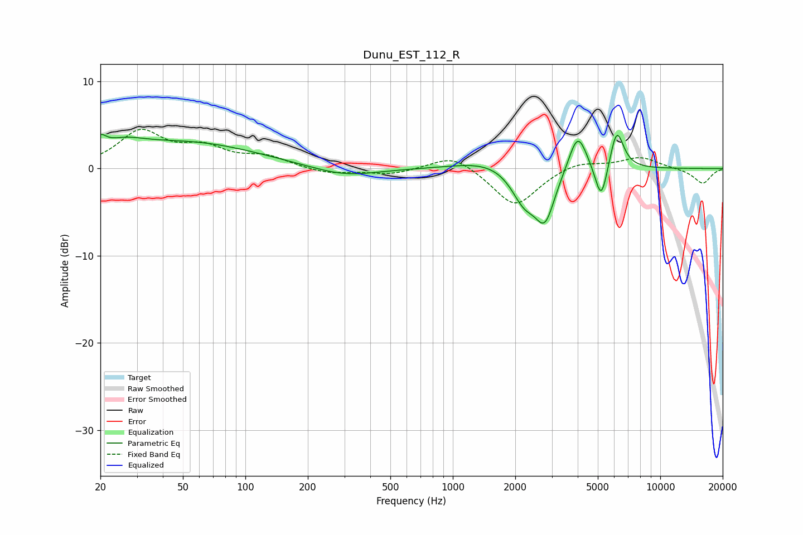

# Dunu_EST_112_R
See [usage instructions](https://github.com/jaakkopasanen/AutoEq#usage) for more options and info.

### Parametric EQs
Apply preamp of -4.0 dB when using parametric equalizer.

|   # | Type    |   Fc (Hz) |    Q |   Gain (dB) |
|-----|---------|-----------|------|-------------|
|   1 | Peaking |        20 | 5.2  |         1.4 |
|   2 | Peaking |        26 | 1.36 |         1.4 |
|   3 | Peaking |        53 | 0.41 |         2.9 |
|   4 | Peaking |       300 | 0.9  |        -1.1 |
|   5 | Peaking |      1499 | 0.92 |         1.1 |
|   6 | Peaking |      2204 | 2.28 |        -3.6 |
|   7 | Peaking |      2783 | 2.9  |        -5.5 |
|   8 | Peaking |      4003 | 3.19 |         4.6 |
|   9 | Peaking |      5195 | 4.67 |        -4.6 |
|  10 | Peaking |      6169 | 4.15 |         4.7 |

### Fixed Band EQs
When using fixed band (also called graphic) equalizer, apply preamp of **-4.6 dB** (if available) and set gains manually with these parameters.

|   # | Type    |   Fc (Hz) |    Q |   Gain (dB) |
|-----|---------|-----------|------|-------------|
|   1 | Peaking |        31 | 1.41 |         4.1 |
|   2 | Peaking |        62 | 1.41 |         2.1 |
|   3 | Peaking |       125 | 1.41 |         1.2 |
|   4 | Peaking |       250 | 1.41 |        -0.6 |
|   5 | Peaking |       500 | 1.41 |        -0.7 |
|   6 | Peaking |      1000 | 1.41 |         1.8 |
|   7 | Peaking |      2000 | 1.41 |        -4.4 |
|   8 | Peaking |      4000 | 1.41 |         0.9 |
|   9 | Peaking |      8000 | 1.41 |         1.3 |
|  10 | Peaking |     16000 | 1.41 |        -1.7 |

### Graphs

