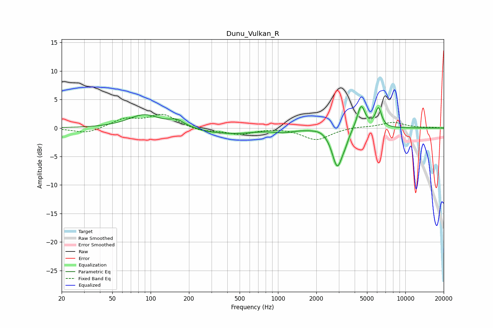

# Dunu_Vulkan_R
See [usage instructions](https://github.com/jaakkopasanen/AutoEq#usage) for more options and info.

### Parametric EQs
Apply preamp of -3.9 dB when using parametric equalizer.

|   # | Type    |   Fc (Hz) |    Q |   Gain (dB) |
|-----|---------|-----------|------|-------------|
|   1 | Peaking |        89 | 1.14 |         2.3 |
|   2 | Peaking |       160 | 2.68 |         1   |
|   3 | Peaking |       287 | 1.84 |        -0.3 |
|   4 | Peaking |       450 | 0.85 |        -0.9 |
|   5 | Peaking |      1097 | 1.91 |        -0.5 |
|   6 | Peaking |      2174 | 2.62 |         0.4 |
|   7 | Peaking |      2925 | 3.39 |        -6.8 |
|   8 | Peaking |      3368 | 5.68 |        -0.9 |
|   9 | Peaking |      4493 | 4.42 |         4.3 |
|  10 | Peaking |      6145 | 5.71 |         3.4 |

### Fixed Band EQs
When using fixed band (also called graphic) equalizer, apply preamp of **-2.5 dB** (if available) and set gains manually with these parameters.

|   # | Type    |   Fc (Hz) |    Q |   Gain (dB) |
|-----|---------|-----------|------|-------------|
|   1 | Peaking |        31 | 1.41 |        -1   |
|   2 | Peaking |        62 | 1.41 |         1.5 |
|   3 | Peaking |       125 | 1.41 |         2.3 |
|   4 | Peaking |       250 | 1.41 |        -0.6 |
|   5 | Peaking |       500 | 1.41 |        -1.1 |
|   6 | Peaking |      1000 | 1.41 |         0.1 |
|   7 | Peaking |      2000 | 1.41 |        -2.1 |
|   8 | Peaking |      4000 | 1.41 |         0.2 |
|   9 | Peaking |      8000 | 1.41 |         1   |
|  10 | Peaking |     16000 | 1.41 |         0.1 |

### Graphs

