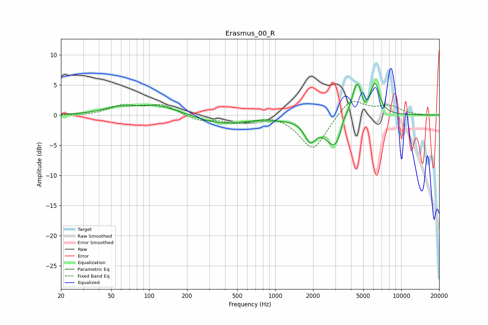

# Erasmus_00_R
See [usage instructions](https://github.com/jaakkopasanen/AutoEq#usage) for more options and info.

### Parametric EQs
Apply preamp of -5.3 dB when using parametric equalizer.

|   # | Type    |   Fc (Hz) |    Q |   Gain (dB) |
|-----|---------|-----------|------|-------------|
|   1 | Peaking |        54 | 1.5  |         0.8 |
|   2 | Peaking |       112 | 0.75 |         1.7 |
|   3 | Peaking |       367 | 0.72 |        -1.5 |
|   4 | Peaking |      1031 | 1.05 |        -0.3 |
|   5 | Peaking |      1890 | 3.17 |        -3.3 |
|   6 | Peaking |      3016 | 1.85 |        -5.9 |
|   7 | Peaking |      3493 | 5.28 |         1.6 |
|   8 | Peaking |      4473 | 2.84 |         6.7 |
|   9 | Peaking |      5089 | 6    |        -1.9 |
|  10 | Peaking |      6201 | 4.07 |         4.8 |

### Fixed Band EQs
When using fixed band (also called graphic) equalizer, apply preamp of **-2.3 dB** (if available) and set gains manually with these parameters.

|   # | Type    |   Fc (Hz) |    Q |   Gain (dB) |
|-----|---------|-----------|------|-------------|
|   1 | Peaking |        31 | 1.41 |        -0.2 |
|   2 | Peaking |        62 | 1.41 |         1.5 |
|   3 | Peaking |       125 | 1.41 |         1.7 |
|   4 | Peaking |       250 | 1.41 |        -0.9 |
|   5 | Peaking |       500 | 1.41 |        -1.2 |
|   6 | Peaking |      1000 | 1.41 |         0.3 |
|   7 | Peaking |      2000 | 1.41 |        -5.9 |
|   8 | Peaking |      4000 | 1.41 |         3   |
|   9 | Peaking |      8000 | 1.41 |         1.4 |
|  10 | Peaking |     16000 | 1.41 |        -0.1 |

### Graphs

