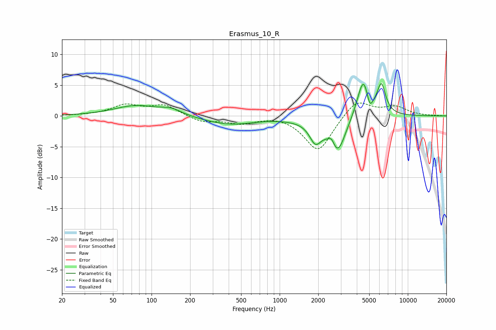

# Erasmus_10_R
See [usage instructions](https://github.com/jaakkopasanen/AutoEq#usage) for more options and info.

### Parametric EQs
Apply preamp of -5.3 dB when using parametric equalizer.

|   # | Type    |   Fc (Hz) |    Q |   Gain (dB) |
|-----|---------|-----------|------|-------------|
|   1 | Peaking |        76 | 0.83 |         1.7 |
|   2 | Peaking |       142 | 1.73 |         0.9 |
|   3 | Peaking |       405 | 0.7  |        -1.4 |
|   4 | Peaking |      1341 | 1.11 |        -0.3 |
|   5 | Peaking |      1899 | 3.08 |        -3.2 |
|   6 | Peaking |      2547 | 5.27 |         1.6 |
|   7 | Peaking |      2804 | 2.19 |        -6.2 |
|   8 | Peaking |      4505 | 2.88 |         6.6 |
|   9 | Peaking |      5041 | 5.95 |        -2.4 |
|  10 | Peaking |      6218 | 4.19 |         4.6 |

### Fixed Band EQs
When using fixed band (also called graphic) equalizer, apply preamp of **-2.2 dB** (if available) and set gains manually with these parameters.

|   # | Type    |   Fc (Hz) |    Q |   Gain (dB) |
|-----|---------|-----------|------|-------------|
|   1 | Peaking |        31 | 1.41 |         0.1 |
|   2 | Peaking |        62 | 1.41 |         1.7 |
|   3 | Peaking |       125 | 1.41 |         1.7 |
|   4 | Peaking |       250 | 1.41 |        -1   |
|   5 | Peaking |       500 | 1.41 |        -1.1 |
|   6 | Peaking |      1000 | 1.41 |         0.2 |
|   7 | Peaking |      2000 | 1.41 |        -5.8 |
|   8 | Peaking |      4000 | 1.41 |         2.8 |
|   9 | Peaking |      8000 | 1.41 |         1.4 |
|  10 | Peaking |     16000 | 1.41 |         0   |

### Graphs

