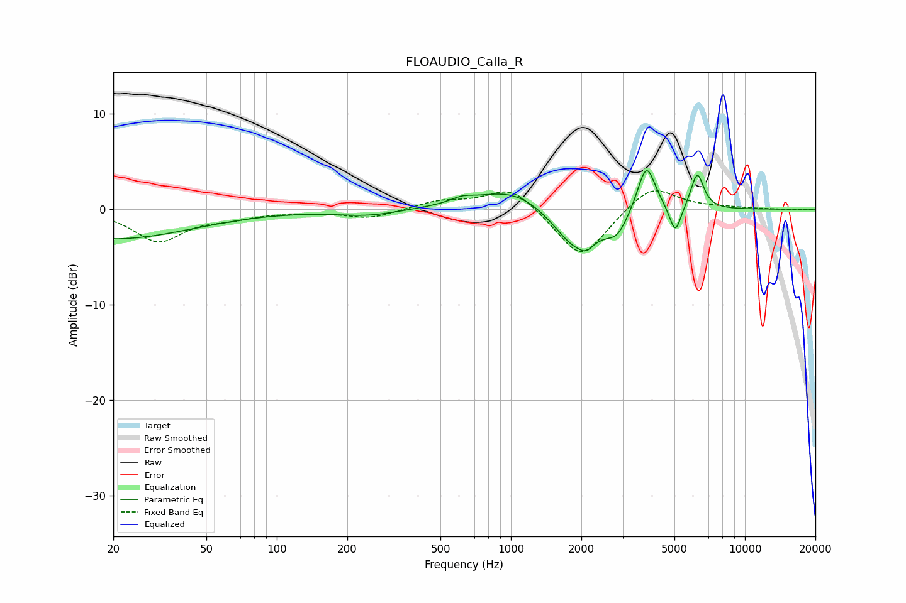

# FLOAUDIO_Calla_R
See [usage instructions](https://github.com/jaakkopasanen/AutoEq#usage) for more options and info.

### Parametric EQs
Apply preamp of -4.2 dB when using parametric equalizer.

|   # | Type    |   Fc (Hz) |    Q |   Gain (dB) |
|-----|---------|-----------|------|-------------|
|   1 | Peaking |        20 | 0.42 |        -3.1 |
|   2 | Peaking |       245 | 1.07 |        -0.7 |
|   3 | Peaking |       617 | 3.06 |         0.5 |
|   4 | Peaking |      1029 | 0.87 |         2.4 |
|   5 | Peaking |      1917 | 1.4  |        -4.8 |
|   6 | Peaking |      2101 | 5.82 |        -0.6 |
|   7 | Peaking |      2841 | 3.11 |        -1.9 |
|   8 | Peaking |      3793 | 3.66 |         5.2 |
|   9 | Peaking |      5041 | 5.72 |        -3   |
|  10 | Peaking |      6254 | 5.02 |         3.8 |

### Fixed Band EQs
When using fixed band (also called graphic) equalizer, apply preamp of **-2.0 dB** (if available) and set gains manually with these parameters.

|   # | Type    |   Fc (Hz) |    Q |   Gain (dB) |
|-----|---------|-----------|------|-------------|
|   1 | Peaking |        31 | 1.41 |        -3.3 |
|   2 | Peaking |        62 | 1.41 |        -0.7 |
|   3 | Peaking |       125 | 1.41 |        -0.2 |
|   4 | Peaking |       250 | 1.41 |        -0.9 |
|   5 | Peaking |       500 | 1.41 |         0.8 |
|   6 | Peaking |      1000 | 1.41 |         2.5 |
|   7 | Peaking |      2000 | 1.41 |        -5.4 |
|   8 | Peaking |      4000 | 1.41 |         2.7 |
|   9 | Peaking |      8000 | 1.41 |         0.1 |
|  10 | Peaking |     16000 | 1.41 |        -0.1 |

### Graphs

