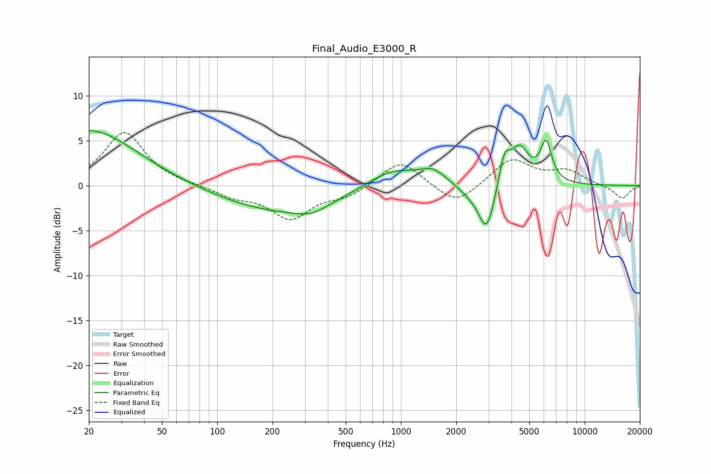

# Final_Audio_E3000_R
See [usage instructions](https://github.com/jaakkopasanen/AutoEq#usage) for more options and info.

### Parametric EQs
Apply preamp of -6.2 dB when using parametric equalizer.

|   # | Type    |   Fc (Hz) |    Q |   Gain (dB) |
|-----|---------|-----------|------|-------------|
|   1 | Peaking |        20 | 0.55 |         6.3 |
|   2 | Peaking |       208 | 0.44 |        -2.8 |
|   3 | Peaking |       326 | 1.46 |        -1.1 |
|   4 | Peaking |       907 | 1    |         2.1 |
|   5 | Peaking |      1497 | 2.04 |         1.4 |
|   6 | Peaking |      2384 | 1.95 |        -0.8 |
|   7 | Peaking |      2933 | 3.17 |        -5.3 |
|   8 | Peaking |      3654 | 4.77 |         3.2 |
|   9 | Peaking |      4412 | 2.61 |         4.1 |
|  10 | Peaking |      6166 | 4.51 |         4.3 |

### Fixed Band EQs
When using fixed band (also called graphic) equalizer, apply preamp of **-6.0 dB** (if available) and set gains manually with these parameters.

|   # | Type    |   Fc (Hz) |    Q |   Gain (dB) |
|-----|---------|-----------|------|-------------|
|   1 | Peaking |        31 | 1.41 |         6   |
|   2 | Peaking |        62 | 1.41 |         0.1 |
|   3 | Peaking |       125 | 1.41 |        -1.1 |
|   4 | Peaking |       250 | 1.41 |        -3.5 |
|   5 | Peaking |       500 | 1.41 |        -1.1 |
|   6 | Peaking |      1000 | 1.41 |         2.9 |
|   7 | Peaking |      2000 | 1.41 |        -2.3 |
|   8 | Peaking |      4000 | 1.41 |         3   |
|   9 | Peaking |      8000 | 1.41 |         1.5 |
|  10 | Peaking |     16000 | 1.41 |        -1.5 |

### Graphs

