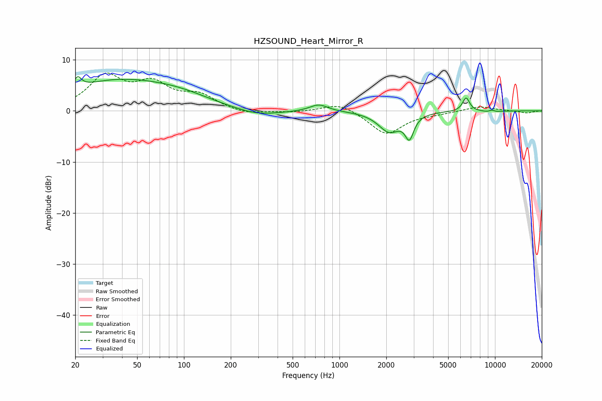

# HZSOUND_Heart_Mirror_R
See [usage instructions](https://github.com/jaakkopasanen/AutoEq#usage) for more options and info.

### Parametric EQs
Apply preamp of -6.8 dB when using parametric equalizer.

|   # | Type    |   Fc (Hz) |    Q |   Gain (dB) |
|-----|---------|-----------|------|-------------|
|   1 | Peaking |        21 | 5.97 |         2.1 |
|   2 | Peaking |        37 | 0.42 |         5.6 |
|   3 | Peaking |        95 | 0.69 |         1.6 |
|   4 | Peaking |       296 | 0.97 |        -1.2 |
|   5 | Peaking |       737 | 2.44 |         1.4 |
|   6 | Peaking |      2092 | 2.04 |        -3.9 |
|   7 | Peaking |      2817 | 5.18 |        -4.3 |
|   8 | Peaking |      6520 | 6    |         2.7 |
|   9 | Peaking |      9508 | 4.24 |        -3   |
|  10 | Peaking |      9518 | 4.76 |         3.1 |

### Fixed Band EQs
When using fixed band (also called graphic) equalizer, apply preamp of **-7.5 dB** (if available) and set gains manually with these parameters.

|   # | Type    |   Fc (Hz) |    Q |   Gain (dB) |
|-----|---------|-----------|------|-------------|
|   1 | Peaking |        31 | 1.41 |         6.4 |
|   2 | Peaking |        62 | 1.41 |         4.7 |
|   3 | Peaking |       125 | 1.41 |         2.7 |
|   4 | Peaking |       250 | 1.41 |        -0.8 |
|   5 | Peaking |       500 | 1.41 |        -0.3 |
|   6 | Peaking |      1000 | 1.41 |         1.7 |
|   7 | Peaking |      2000 | 1.41 |        -4.6 |
|   8 | Peaking |      4000 | 1.41 |        -0.4 |
|   9 | Peaking |      8000 | 1.41 |         0.9 |
|  10 | Peaking |     16000 | 1.41 |        -0.4 |

### Graphs

