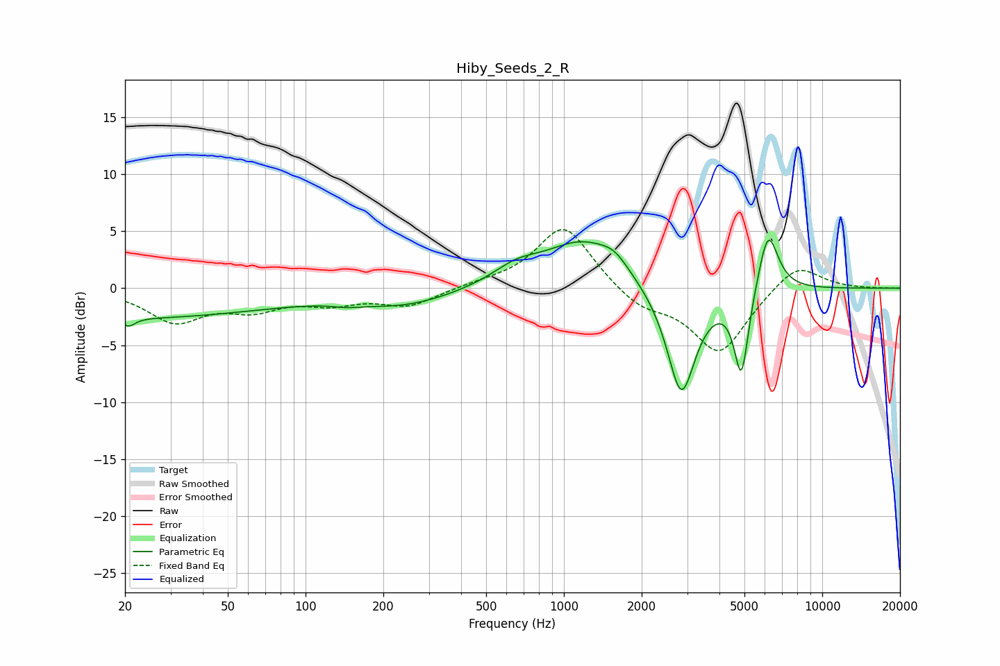

# Hiby_Seeds_2_R
See [usage instructions](https://github.com/jaakkopasanen/AutoEq#usage) for more options and info.

### Parametric EQs
Apply preamp of -4.3 dB when using parametric equalizer.

|   # | Type    |   Fc (Hz) |    Q |   Gain (dB) |
|-----|---------|-----------|------|-------------|
|   1 | Peaking |        20 | 0.24 |        -2.6 |
|   2 | Peaking |        21 | 5.85 |        -0.7 |
|   3 | Peaking |       144 | 3.05 |        -0.2 |
|   4 | Peaking |       240 | 0.72 |        -1.4 |
|   5 | Peaking |       652 | 1.5  |         1.4 |
|   6 | Peaking |      1191 | 0.94 |         4.1 |
|   7 | Peaking |      1572 | 2.67 |         1   |
|   8 | Peaking |      2847 | 2.48 |        -9.8 |
|   9 | Peaking |      4866 | 4.91 |        -7.6 |
|  10 | Peaking |      6168 | 3.5  |         5.6 |

### Fixed Band EQs
When using fixed band (also called graphic) equalizer, apply preamp of **-5.2 dB** (if available) and set gains manually with these parameters.

|   # | Type    |   Fc (Hz) |    Q |   Gain (dB) |
|-----|---------|-----------|------|-------------|
|   1 | Peaking |        31 | 1.41 |        -2.8 |
|   2 | Peaking |        62 | 1.41 |        -1.6 |
|   3 | Peaking |       125 | 1.41 |        -1.1 |
|   4 | Peaking |       250 | 1.41 |        -1.5 |
|   5 | Peaking |       500 | 1.41 |         0.3 |
|   6 | Peaking |      1000 | 1.41 |         5.6 |
|   7 | Peaking |      2000 | 1.41 |        -1.7 |
|   8 | Peaking |      4000 | 1.41 |        -5.7 |
|   9 | Peaking |      8000 | 1.41 |         2.4 |
|  10 | Peaking |     16000 | 1.41 |        -0   |

### Graphs

