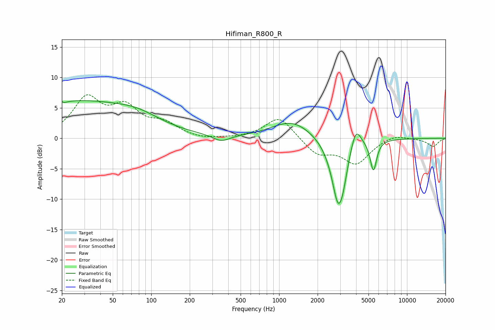

# Hifiman_R800_R
See [usage instructions](https://github.com/jaakkopasanen/AutoEq#usage) for more options and info.

### Parametric EQs
Apply preamp of -6.3 dB when using parametric equalizer.

|   # | Type    |   Fc (Hz) |    Q |   Gain (dB) |
|-----|---------|-----------|------|-------------|
|   1 | Peaking |        20 | 6    |         3.9 |
|   2 | Peaking |        20 | 5.99 |        -3.9 |
|   3 | Peaking |        26 | 0.27 |         6   |
|   4 | Peaking |        79 | 0.9  |         1.1 |
|   5 | Peaking |       353 | 2.1  |        -1.1 |
|   6 | Peaking |      1266 | 0.89 |         2.9 |
|   7 | Peaking |      2900 | 2.63 |       -10.9 |
|   8 | Peaking |      3178 | 4.66 |        -1.8 |
|   9 | Peaking |      3978 | 3.52 |         3.7 |
|  10 | Peaking |      5464 | 5.69 |        -5.1 |

### Fixed Band EQs
When using fixed band (also called graphic) equalizer, apply preamp of **-7.3 dB** (if available) and set gains manually with these parameters.

|   # | Type    |   Fc (Hz) |    Q |   Gain (dB) |
|-----|---------|-----------|------|-------------|
|   1 | Peaking |        31 | 1.41 |         6.2 |
|   2 | Peaking |        62 | 1.41 |         4.5 |
|   3 | Peaking |       125 | 1.41 |         2.1 |
|   4 | Peaking |       250 | 1.41 |        -0.3 |
|   5 | Peaking |       500 | 1.41 |        -0   |
|   6 | Peaking |      1000 | 1.41 |         3.6 |
|   7 | Peaking |      2000 | 1.41 |        -2.6 |
|   8 | Peaking |      4000 | 1.41 |        -4   |
|   9 | Peaking |      8000 | 1.41 |         0.8 |
|  10 | Peaking |     16000 | 1.41 |        -1.3 |

### Graphs

