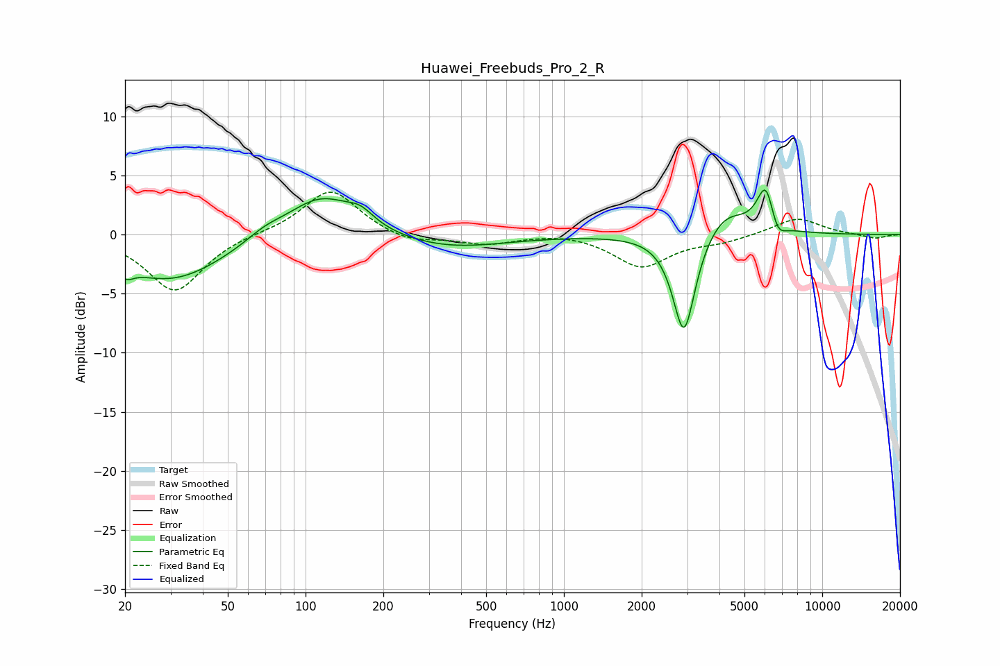

# Huawei_Freebuds_Pro_2_R
See [usage instructions](https://github.com/jaakkopasanen/AutoEq#usage) for more options and info.

### Parametric EQs
Apply preamp of -3.9 dB when using parametric equalizer.

|   # | Type    |   Fc (Hz) |    Q |   Gain (dB) |
|-----|---------|-----------|------|-------------|
|   1 | Peaking |        20 | 5.16 |        -0.9 |
|   2 | Peaking |        30 | 0.67 |        -3.9 |
|   3 | Peaking |        69 | 1.95 |         0.7 |
|   4 | Peaking |       115 | 1.06 |         3.6 |
|   5 | Peaking |       163 | 2.76 |         1   |
|   6 | Peaking |       353 | 0.65 |        -1.2 |
|   7 | Peaking |      2917 | 3.22 |        -8.8 |
|   8 | Peaking |      4183 | 1.62 |         2.2 |
|   9 | Peaking |      6057 | 4.01 |         4.1 |
|  10 | Peaking |      6670 | 4.39 |        -1.7 |

### Fixed Band EQs
When using fixed band (also called graphic) equalizer, apply preamp of **-3.7 dB** (if available) and set gains manually with these parameters.

|   # | Type    |   Fc (Hz) |    Q |   Gain (dB) |
|-----|---------|-----------|------|-------------|
|   1 | Peaking |        31 | 1.41 |        -4.8 |
|   2 | Peaking |        62 | 1.41 |         0.1 |
|   3 | Peaking |       125 | 1.41 |         3.9 |
|   4 | Peaking |       250 | 1.41 |        -0.8 |
|   5 | Peaking |       500 | 1.41 |        -0.8 |
|   6 | Peaking |      1000 | 1.41 |         0.2 |
|   7 | Peaking |      2000 | 1.41 |        -2.7 |
|   8 | Peaking |      4000 | 1.41 |        -0.5 |
|   9 | Peaking |      8000 | 1.41 |         1.4 |
|  10 | Peaking |     16000 | 1.41 |        -0.4 |

### Graphs

