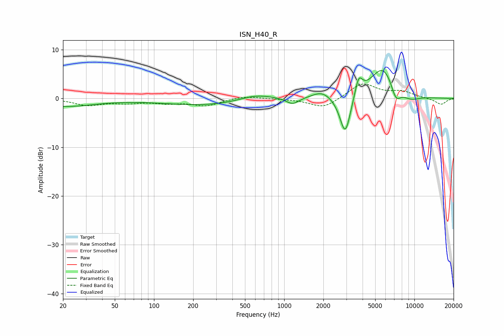

# ISN_H40_R
See [usage instructions](https://github.com/jaakkopasanen/AutoEq#usage) for more options and info.

### Parametric EQs
Apply preamp of -5.8 dB when using parametric equalizer.

|   # | Type    |   Fc (Hz) |    Q |   Gain (dB) |
|-----|---------|-----------|------|-------------|
|   1 | Peaking |        20 | 0.61 |        -1.6 |
|   2 | Peaking |       264 | 0.4  |        -1.4 |
|   3 | Peaking |       606 | 1.03 |         1.4 |
|   4 | Peaking |      1159 | 2.92 |        -1.3 |
|   5 | Peaking |      1957 | 1.88 |         1.5 |
|   6 | Peaking |      2945 | 3.29 |        -8.5 |
|   7 | Peaking |      3731 | 4.92 |         3.9 |
|   8 | Peaking |      5769 | 1.34 |         6.9 |
|   9 | Peaking |      7199 | 3.45 |        -3.6 |
|  10 | Peaking |      9227 | 1.7  |        -1.4 |

### Fixed Band EQs
When using fixed band (also called graphic) equalizer, apply preamp of **-3.1 dB** (if available) and set gains manually with these parameters.

|   # | Type    |   Fc (Hz) |    Q |   Gain (dB) |
|-----|---------|-----------|------|-------------|
|   1 | Peaking |        31 | 1.41 |        -1.3 |
|   2 | Peaking |        62 | 1.41 |        -0.7 |
|   3 | Peaking |       125 | 1.41 |        -0.8 |
|   4 | Peaking |       250 | 1.41 |        -1.4 |
|   5 | Peaking |       500 | 1.41 |         0.6 |
|   6 | Peaking |      1000 | 1.41 |        -0.1 |
|   7 | Peaking |      2000 | 1.41 |        -2.1 |
|   8 | Peaking |      4000 | 1.41 |         3.1 |
|   9 | Peaking |      8000 | 1.41 |         1.3 |
|  10 | Peaking |     16000 | 1.41 |        -1.3 |

### Graphs

