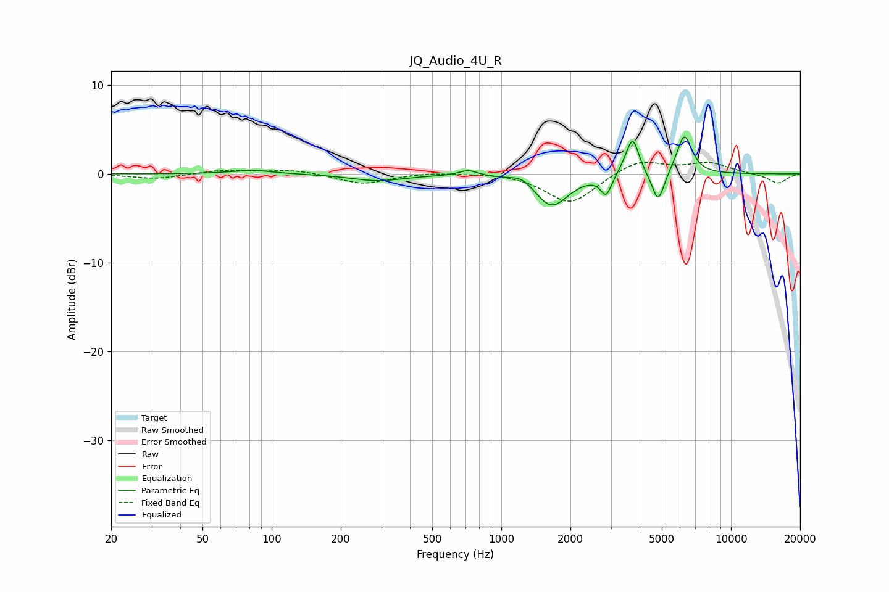

# JQ_Audio_4U_R
See [usage instructions](https://github.com/jaakkopasanen/AutoEq#usage) for more options and info.

### Parametric EQs
Apply preamp of -4.2 dB when using parametric equalizer.

|   # | Type    |   Fc (Hz) |    Q |   Gain (dB) |
|-----|---------|-----------|------|-------------|
|   1 | Peaking |        82 | 1.59 |         0.4 |
|   2 | Peaking |       289 | 1.23 |        -0.8 |
|   3 | Peaking |       718 | 3.58 |         0.7 |
|   4 | Peaking |      1233 | 3.01 |         0.8 |
|   5 | Peaking |      1654 | 1.95 |        -3.7 |
|   6 | Peaking |      2862 | 5.96 |        -2.3 |
|   7 | Peaking |      3583 | 3.9  |         1   |
|   8 | Peaking |      3742 | 5.43 |         3.5 |
|   9 | Peaking |      4817 | 5.27 |        -3.6 |
|  10 | Peaking |      6267 | 4.18 |         4.5 |

### Fixed Band EQs
When using fixed band (also called graphic) equalizer, apply preamp of **-1.4 dB** (if available) and set gains manually with these parameters.

|   # | Type    |   Fc (Hz) |    Q |   Gain (dB) |
|-----|---------|-----------|------|-------------|
|   1 | Peaking |        31 | 1.41 |        -0.6 |
|   2 | Peaking |        62 | 1.41 |         0.4 |
|   3 | Peaking |       125 | 1.41 |         0.5 |
|   4 | Peaking |       250 | 1.41 |        -1.1 |
|   5 | Peaking |       500 | 1.41 |         0.2 |
|   6 | Peaking |      1000 | 1.41 |         0.2 |
|   7 | Peaking |      2000 | 1.41 |        -3.4 |
|   8 | Peaking |      4000 | 1.41 |         1.7 |
|   9 | Peaking |      8000 | 1.41 |         1.2 |
|  10 | Peaking |     16000 | 1.41 |        -1.1 |

### Graphs

