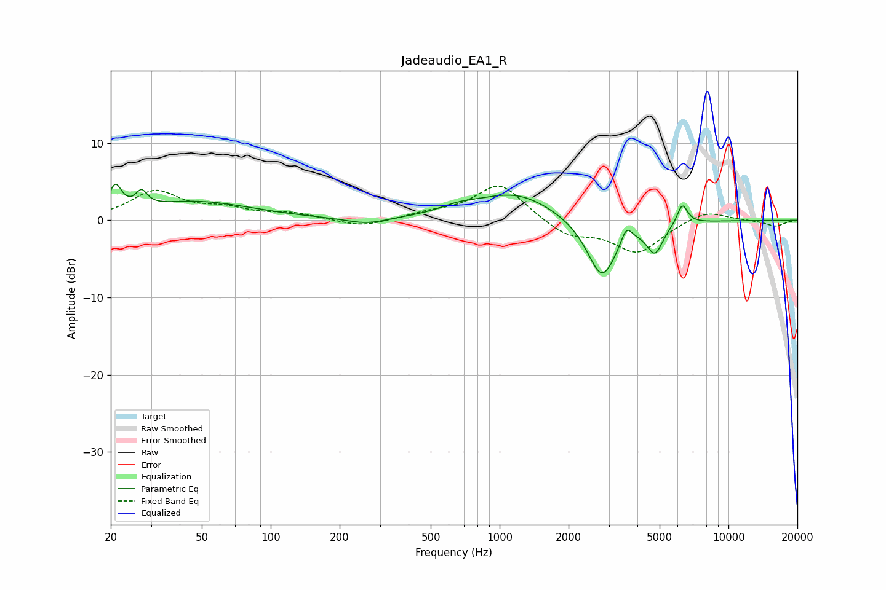

# Jadeaudio_EA1_R
See [usage instructions](https://github.com/jaakkopasanen/AutoEq#usage) for more options and info.

### Parametric EQs
Apply preamp of -4.8 dB when using parametric equalizer.

|   # | Type    |   Fc (Hz) |    Q |   Gain (dB) |
|-----|---------|-----------|------|-------------|
|   1 | Peaking |        21 | 5.33 |         3.3 |
|   2 | Peaking |        27 | 5.81 |         2   |
|   3 | Peaking |        47 | 0.58 |         2.4 |
|   4 | Peaking |       262 | 1.6  |        -0.8 |
|   5 | Peaking |       662 | 1.7  |         0.8 |
|   6 | Peaking |      1173 | 0.82 |         3.5 |
|   7 | Peaking |      2798 | 2.14 |        -7.8 |
|   8 | Peaking |      3580 | 5.99 |         2.1 |
|   9 | Peaking |      4769 | 3.89 |        -3.7 |
|  10 | Peaking |      6286 | 5.99 |         2.7 |

### Fixed Band EQs
When using fixed band (also called graphic) equalizer, apply preamp of **-4.5 dB** (if available) and set gains manually with these parameters.

|   # | Type    |   Fc (Hz) |    Q |   Gain (dB) |
|-----|---------|-----------|------|-------------|
|   1 | Peaking |        31 | 1.41 |         3.6 |
|   2 | Peaking |        62 | 1.41 |         1.2 |
|   3 | Peaking |       125 | 1.41 |         0.8 |
|   4 | Peaking |       250 | 1.41 |        -1   |
|   5 | Peaking |       500 | 1.41 |         0.7 |
|   6 | Peaking |      1000 | 1.41 |         4.8 |
|   7 | Peaking |      2000 | 1.41 |        -2.1 |
|   8 | Peaking |      4000 | 1.41 |        -4.1 |
|   9 | Peaking |      8000 | 1.41 |         1.4 |
|  10 | Peaking |     16000 | 1.41 |        -0.8 |

### Graphs

