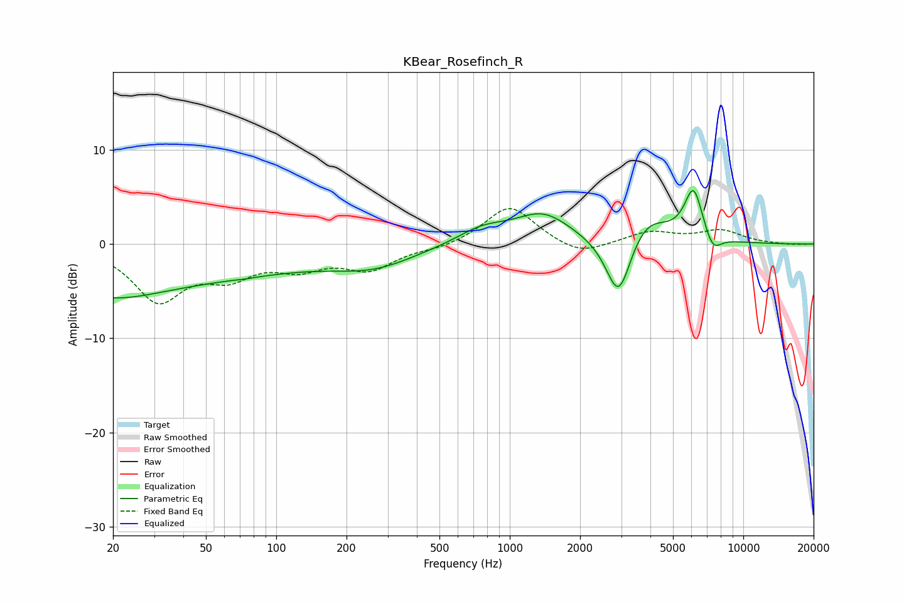

# KBear_Rosefinch_R
See [usage instructions](https://github.com/jaakkopasanen/AutoEq#usage) for more options and info.

### Parametric EQs
Apply preamp of -5.8 dB when using parametric equalizer.

|   # | Type    |   Fc (Hz) |    Q |   Gain (dB) |
|-----|---------|-----------|------|-------------|
|   1 | Peaking |        20 | 0.71 |        -1.9 |
|   2 | Peaking |        25 | 0.18 |        -3.8 |
|   3 | Peaking |        74 | 5.89 |        -0.1 |
|   4 | Peaking |       261 | 0.78 |        -2   |
|   5 | Peaking |       763 | 1.27 |         1.6 |
|   6 | Peaking |      1388 | 1.17 |         3.1 |
|   7 | Peaking |      2928 | 2.53 |        -7.2 |
|   8 | Peaking |      3815 | 1.49 |         3.2 |
|   9 | Peaking |      6124 | 3.47 |         5.5 |
|  10 | Peaking |      7397 | 3.81 |        -1.9 |

### Fixed Band EQs
When using fixed band (also called graphic) equalizer, apply preamp of **-3.9 dB** (if available) and set gains manually with these parameters.

|   # | Type    |   Fc (Hz) |    Q |   Gain (dB) |
|-----|---------|-----------|------|-------------|
|   1 | Peaking |        31 | 1.41 |        -5.7 |
|   2 | Peaking |        62 | 1.41 |        -2.8 |
|   3 | Peaking |       125 | 1.41 |        -2.1 |
|   4 | Peaking |       250 | 1.41 |        -2.5 |
|   5 | Peaking |       500 | 1.41 |        -0.5 |
|   6 | Peaking |      1000 | 1.41 |         4.2 |
|   7 | Peaking |      2000 | 1.41 |        -1.4 |
|   8 | Peaking |      4000 | 1.41 |         1.3 |
|   9 | Peaking |      8000 | 1.41 |         1.4 |
|  10 | Peaking |     16000 | 1.41 |        -0.1 |

### Graphs

