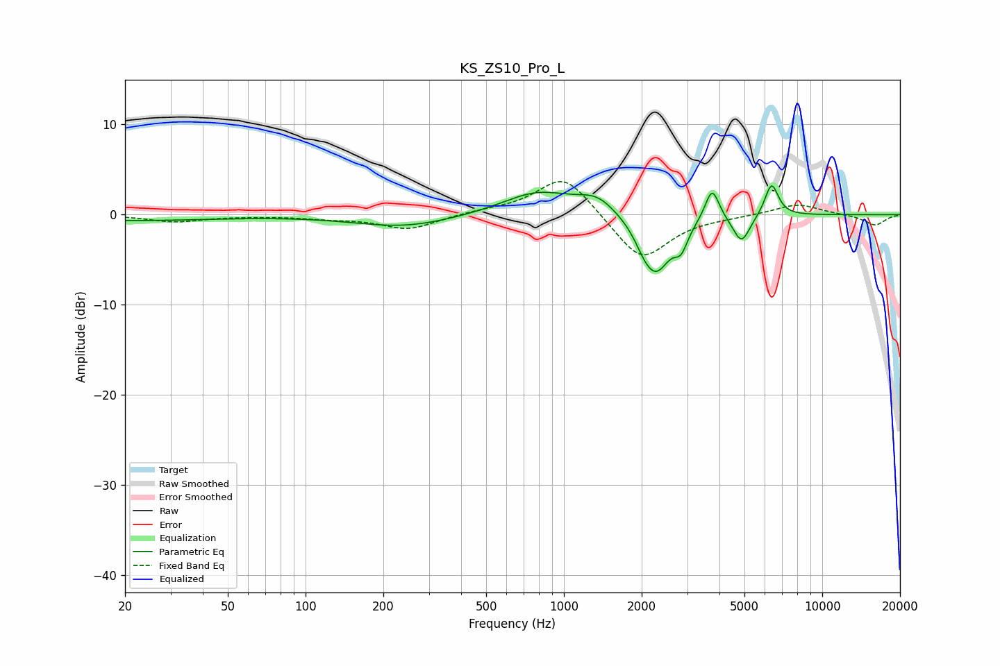

# KS_ZS10_Pro_L
See [usage instructions](https://github.com/jaakkopasanen/AutoEq#usage) for more options and info.

### Parametric EQs
Apply preamp of -3.3 dB when using parametric equalizer.

|   # | Type    |   Fc (Hz) |    Q |   Gain (dB) |
|-----|---------|-----------|------|-------------|
|   1 | Peaking |        20 | 0.4  |        -0.6 |
|   2 | Peaking |       241 | 0.73 |        -1.4 |
|   3 | Peaking |       791 | 1.03 |         2.6 |
|   4 | Peaking |      1346 | 1.89 |         1.8 |
|   5 | Peaking |      2034 | 4.35 |        -0.8 |
|   6 | Peaking |      2266 | 2.39 |        -6.3 |
|   7 | Peaking |      2842 | 5.52 |        -2.2 |
|   8 | Peaking |      3747 | 5.18 |         3.7 |
|   9 | Peaking |      4871 | 4.21 |        -3.1 |
|  10 | Peaking |      6365 | 5.25 |         3.7 |

### Fixed Band EQs
When using fixed band (also called graphic) equalizer, apply preamp of **-3.8 dB** (if available) and set gains manually with these parameters.

|   # | Type    |   Fc (Hz) |    Q |   Gain (dB) |
|-----|---------|-----------|------|-------------|
|   1 | Peaking |        31 | 1.41 |        -0.8 |
|   2 | Peaking |        62 | 1.41 |        -0.1 |
|   3 | Peaking |       125 | 1.41 |        -0.4 |
|   4 | Peaking |       250 | 1.41 |        -1.6 |
|   5 | Peaking |       500 | 1.41 |         0.3 |
|   6 | Peaking |      1000 | 1.41 |         4.6 |
|   7 | Peaking |      2000 | 1.41 |        -5.3 |
|   8 | Peaking |      4000 | 1.41 |        -0.2 |
|   9 | Peaking |      8000 | 1.41 |         1.2 |
|  10 | Peaking |     16000 | 1.41 |        -1.2 |

### Graphs

