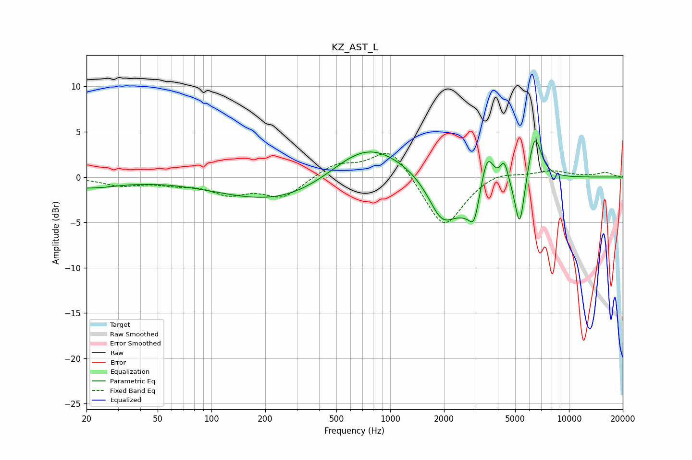

# KZ_AST_L
See [usage instructions](https://github.com/jaakkopasanen/AutoEq#usage) for more options and info.

### Parametric EQs
Apply preamp of -4.1 dB when using parametric equalizer.

|   # | Type    |   Fc (Hz) |    Q |   Gain (dB) |
|-----|---------|-----------|------|-------------|
|   1 | Peaking |        20 | 0.81 |        -1.1 |
|   2 | Peaking |       278 | 0.39 |        -3.3 |
|   3 | Peaking |       727 | 0.65 |         4.9 |
|   4 | Peaking |      1944 | 1.84 |        -4.3 |
|   5 | Peaking |      2947 | 6    |        -1.9 |
|   6 | Peaking |      2957 | 1.48 |        -4.4 |
|   7 | Peaking |      3478 | 3.49 |         5.5 |
|   8 | Peaking |      4345 | 6    |         2.5 |
|   9 | Peaking |      5302 | 5.3  |        -5.9 |
|  10 | Peaking |      6436 | 3.77 |         5.2 |

### Fixed Band EQs
When using fixed band (also called graphic) equalizer, apply preamp of **-2.7 dB** (if available) and set gains manually with these parameters.

|   # | Type    |   Fc (Hz) |    Q |   Gain (dB) |
|-----|---------|-----------|------|-------------|
|   1 | Peaking |        31 | 1.41 |        -0.8 |
|   2 | Peaking |        62 | 1.41 |        -0.6 |
|   3 | Peaking |       125 | 1.41 |        -1.7 |
|   4 | Peaking |       250 | 1.41 |        -2.2 |
|   5 | Peaking |       500 | 1.41 |         1.4 |
|   6 | Peaking |      1000 | 1.41 |         3.4 |
|   7 | Peaking |      2000 | 1.41 |        -5.8 |
|   8 | Peaking |      4000 | 1.41 |         0.8 |
|   9 | Peaking |      8000 | 1.41 |         0.7 |
|  10 | Peaking |     16000 | 1.41 |         0.5 |

### Graphs

