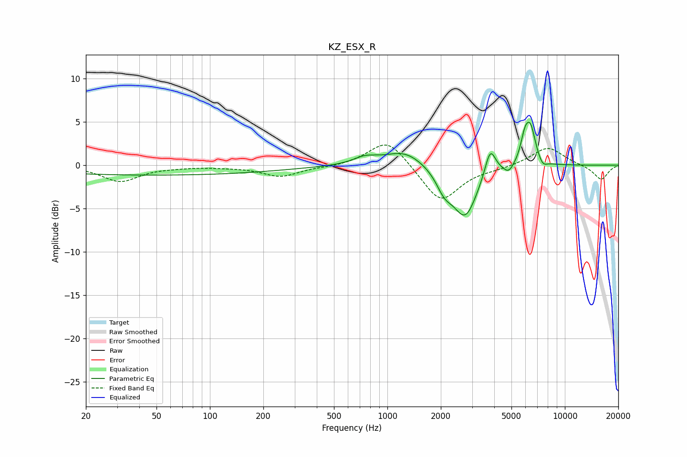

# KZ_ESX_R
See [usage instructions](https://github.com/jaakkopasanen/AutoEq#usage) for more options and info.

### Parametric EQs
Apply preamp of -5.1 dB when using parametric equalizer.

|   # | Type    |   Fc (Hz) |    Q |   Gain (dB) |
|-----|---------|-----------|------|-------------|
|   1 | Peaking |        48 | 0.18 |        -1.1 |
|   2 | Peaking |       750 | 2.13 |         0.8 |
|   3 | Peaking |      1250 | 1.28 |         1.8 |
|   4 | Peaking |      2097 | 3.03 |        -2   |
|   5 | Peaking |      2744 | 2.04 |        -5.8 |
|   6 | Peaking |      3797 | 4.7  |         3.2 |
|   7 | Peaking |      4826 | 5.01 |        -0.9 |
|   8 | Peaking |      5940 | 5.84 |         2.3 |
|   9 | Peaking |      6400 | 4.61 |         4.1 |
|  10 | Peaking |      7491 | 5.59 |        -0.8 |

### Fixed Band EQs
When using fixed band (also called graphic) equalizer, apply preamp of **-2.4 dB** (if available) and set gains manually with these parameters.

|   # | Type    |   Fc (Hz) |    Q |   Gain (dB) |
|-----|---------|-----------|------|-------------|
|   1 | Peaking |        31 | 1.41 |        -1.9 |
|   2 | Peaking |        62 | 1.41 |        -0.1 |
|   3 | Peaking |       125 | 1.41 |        -0.1 |
|   4 | Peaking |       250 | 1.41 |        -1.3 |
|   5 | Peaking |       500 | 1.41 |        -0.2 |
|   6 | Peaking |      1000 | 1.41 |         3.2 |
|   7 | Peaking |      2000 | 1.41 |        -4.3 |
|   8 | Peaking |      4000 | 1.41 |        -0.3 |
|   9 | Peaking |      8000 | 1.41 |         2.2 |
|  10 | Peaking |     16000 | 1.41 |        -1.7 |

### Graphs

