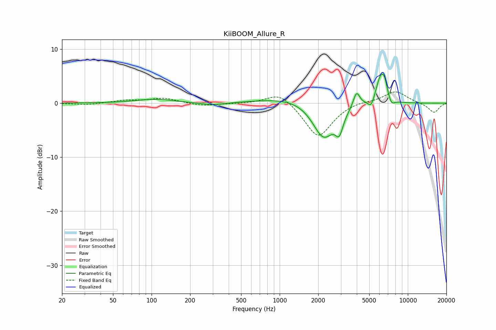

# KiiBOOM_Allure_R
See [usage instructions](https://github.com/jaakkopasanen/AutoEq#usage) for more options and info.

### Parametric EQs
Apply preamp of -5.5 dB when using parametric equalizer.

|   # | Type    |   Fc (Hz) |    Q |   Gain (dB) |
|-----|---------|-----------|------|-------------|
|   1 | Peaking |       107 | 0.97 |         0.7 |
|   2 | Peaking |       299 | 1.48 |        -0.5 |
|   3 | Peaking |      1367 | 0.58 |         1.4 |
|   4 | Peaking |      2198 | 1.61 |        -7   |
|   5 | Peaking |      2919 | 4.67 |        -3.4 |
|   6 | Peaking |      3979 | 5.48 |         2.8 |
|   7 | Peaking |      5172 | 6    |        -1.5 |
|   8 | Peaking |      6115 | 3.9  |         4.6 |
|   9 | Peaking |      6590 | 5.98 |         2.3 |
|  10 | Peaking |      7446 | 5.62 |        -1.3 |

### Fixed Band EQs
When using fixed band (also called graphic) equalizer, apply preamp of **-2.2 dB** (if available) and set gains manually with these parameters.

|   # | Type    |   Fc (Hz) |    Q |   Gain (dB) |
|-----|---------|-----------|------|-------------|
|   1 | Peaking |        31 | 1.41 |        -0.3 |
|   2 | Peaking |        62 | 1.41 |         0.5 |
|   3 | Peaking |       125 | 1.41 |         0.9 |
|   4 | Peaking |       250 | 1.41 |        -0.5 |
|   5 | Peaking |       500 | 1.41 |        -0.1 |
|   6 | Peaking |      1000 | 1.41 |         2.2 |
|   7 | Peaking |      2000 | 1.41 |        -6.4 |
|   8 | Peaking |      4000 | 1.41 |         0.5 |
|   9 | Peaking |      8000 | 1.41 |         2.3 |
|  10 | Peaking |     16000 | 1.41 |        -1.8 |

### Graphs

