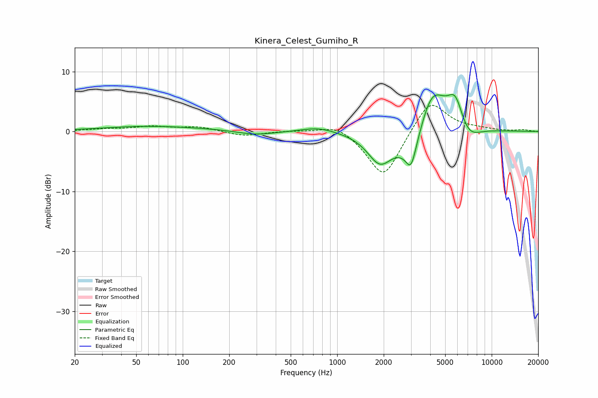

# Kinera_Celest_Gumiho_R
See [usage instructions](https://github.com/jaakkopasanen/AutoEq#usage) for more options and info.

### Parametric EQs
Apply preamp of -6.3 dB when using parametric equalizer.

|   # | Type    |   Fc (Hz) |    Q |   Gain (dB) |
|-----|---------|-----------|------|-------------|
|   1 | Peaking |        60 | 0.46 |         0.9 |
|   2 | Peaking |       201 | 0.71 |         0.2 |
|   3 | Peaking |       292 | 1.11 |        -0.7 |
|   4 | Peaking |       756 | 1.29 |         0.8 |
|   5 | Peaking |      1889 | 1.74 |        -5   |
|   6 | Peaking |      3006 | 4.37 |        -3.8 |
|   7 | Peaking |      3093 | 1.38 |        -5.3 |
|   8 | Peaking |      4087 | 1.42 |         9.1 |
|   9 | Peaking |      5829 | 2.72 |         4.9 |
|  10 | Peaking |      6952 | 1.83 |        -2.9 |

### Fixed Band EQs
When using fixed band (also called graphic) equalizer, apply preamp of **-4.5 dB** (if available) and set gains manually with these parameters.

|   # | Type    |   Fc (Hz) |    Q |   Gain (dB) |
|-----|---------|-----------|------|-------------|
|   1 | Peaking |        31 | 1.41 |         0.4 |
|   2 | Peaking |        62 | 1.41 |         0.8 |
|   3 | Peaking |       125 | 1.41 |         0.7 |
|   4 | Peaking |       250 | 1.41 |        -0.8 |
|   5 | Peaking |       500 | 1.41 |         0.1 |
|   6 | Peaking |      1000 | 1.41 |         1.5 |
|   7 | Peaking |      2000 | 1.41 |        -8   |
|   8 | Peaking |      4000 | 1.41 |         5.7 |
|   9 | Peaking |      8000 | 1.41 |         0.4 |
|  10 | Peaking |     16000 | 1.41 |         0.3 |

### Graphs

