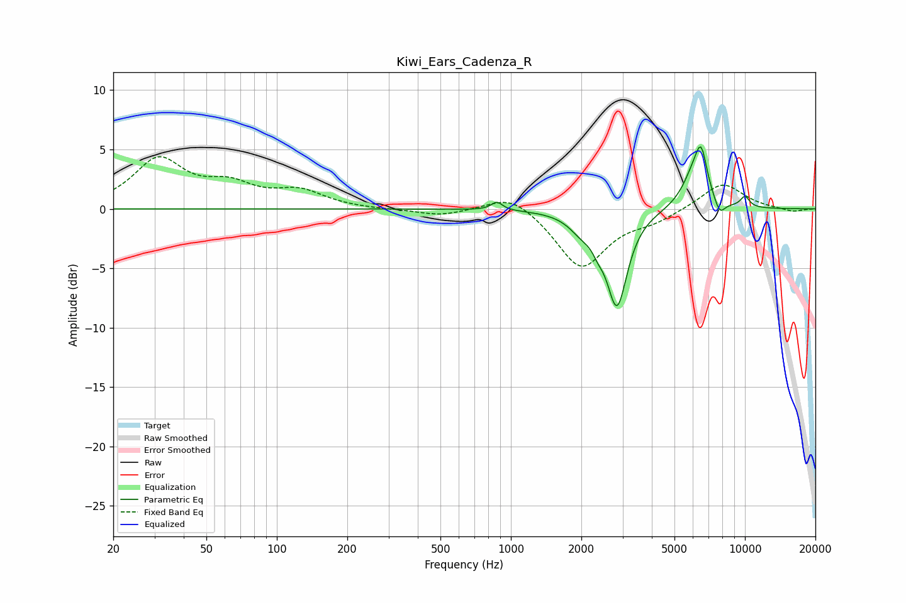

# Kiwi_Ears_Cadenza_R
See [usage instructions](https://github.com/jaakkopasanen/AutoEq#usage) for more options and info.

### Parametric EQs
Apply preamp of -5.3 dB when using parametric equalizer.

|   # | Type    |   Fc (Hz) |    Q |   Gain (dB) |
|-----|---------|-----------|------|-------------|
|   1 | Peaking |       871 | 6    |         0.7 |
|   2 | Peaking |      2006 | 2.66 |        -1.2 |
|   3 | Peaking |      2356 | 6    |        -0.8 |
|   4 | Peaking |      2771 | 1.72 |         0.1 |
|   5 | Peaking |      2839 | 3.14 |        -8   |
|   6 | Peaking |      6033 | 2.63 |         2.4 |
|   7 | Peaking |      6356 | 3.31 |         0.7 |
|   8 | Peaking |      6507 | 5.65 |         2.9 |
|   9 | Peaking |      7798 | 5.69 |        -1.2 |
|  10 | Peaking |     10000 | 6    |         0.9 |

### Fixed Band EQs
When using fixed band (also called graphic) equalizer, apply preamp of **-4.5 dB** (if available) and set gains manually with these parameters.

|   # | Type    |   Fc (Hz) |    Q |   Gain (dB) |
|-----|---------|-----------|------|-------------|
|   1 | Peaking |        31 | 1.41 |         4   |
|   2 | Peaking |        62 | 1.41 |         1.7 |
|   3 | Peaking |       125 | 1.41 |         1.4 |
|   4 | Peaking |       250 | 1.41 |        -0.1 |
|   5 | Peaking |       500 | 1.41 |        -0.6 |
|   6 | Peaking |      1000 | 1.41 |         1.5 |
|   7 | Peaking |      2000 | 1.41 |        -5   |
|   8 | Peaking |      4000 | 1.41 |        -0.8 |
|   9 | Peaking |      8000 | 1.41 |         2.3 |
|  10 | Peaking |     16000 | 1.41 |        -0.3 |

### Graphs

