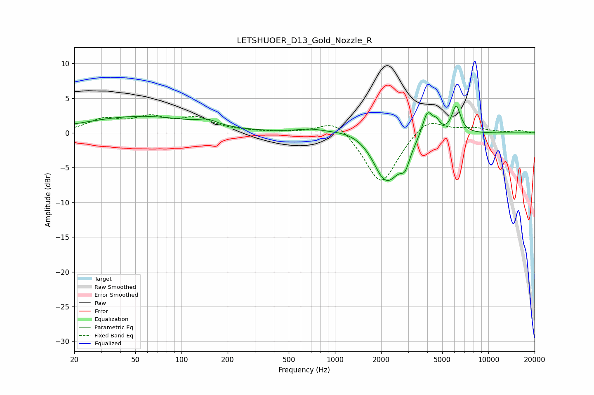

# LETSHUOER_D13_Gold_Nozzle_R
See [usage instructions](https://github.com/jaakkopasanen/AutoEq#usage) for more options and info.

### Parametric EQs
Apply preamp of -3.9 dB when using parametric equalizer.

|   # | Type    |   Fc (Hz) |    Q |   Gain (dB) |
|-----|---------|-----------|------|-------------|
|   1 | Peaking |        54 | 0.39 |         2.4 |
|   2 | Peaking |       149 | 2.41 |         0.7 |
|   3 | Peaking |       683 | 1.76 |         0.4 |
|   4 | Peaking |      1339 | 0.9  |         1   |
|   5 | Peaking |      1961 | 3.15 |        -0.6 |
|   6 | Peaking |      2210 | 1.57 |        -6.9 |
|   7 | Peaking |      2868 | 4.8  |        -2.3 |
|   8 | Peaking |      4006 | 4.06 |         3.8 |
|   9 | Peaking |      4599 | 6    |         1.2 |
|  10 | Peaking |      6171 | 4.76 |         4   |

### Fixed Band EQs
When using fixed band (also called graphic) equalizer, apply preamp of **-2.7 dB** (if available) and set gains manually with these parameters.

|   # | Type    |   Fc (Hz) |    Q |   Gain (dB) |
|-----|---------|-----------|------|-------------|
|   1 | Peaking |        31 | 1.41 |         1.8 |
|   2 | Peaking |        62 | 1.41 |         1.9 |
|   3 | Peaking |       125 | 1.41 |         1.9 |
|   4 | Peaking |       250 | 1.41 |         0.2 |
|   5 | Peaking |       500 | 1.41 |         0   |
|   6 | Peaking |      1000 | 1.41 |         2.2 |
|   7 | Peaking |      2000 | 1.41 |        -7.6 |
|   8 | Peaking |      4000 | 1.41 |         2.4 |
|   9 | Peaking |      8000 | 1.41 |         0.7 |
|  10 | Peaking |     16000 | 1.41 |         0.3 |

### Graphs

