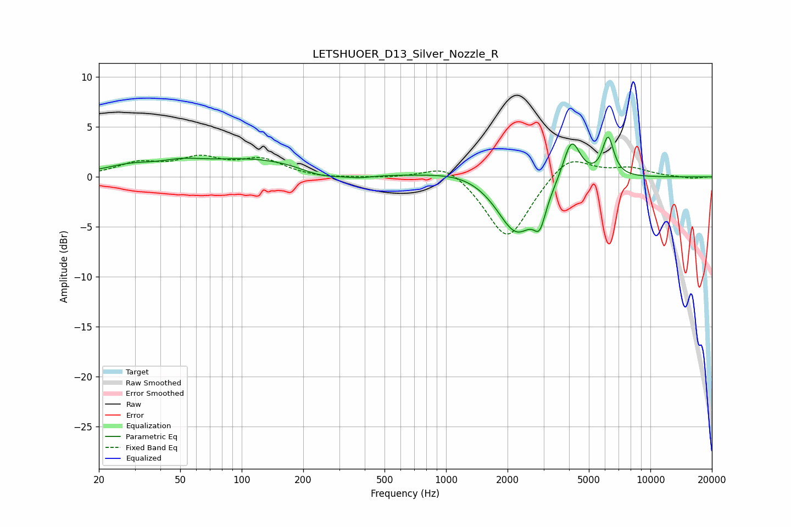

# LETSHUOER_D13_Silver_Nozzle_R
See [usage instructions](https://github.com/jaakkopasanen/AutoEq#usage) for more options and info.

### Parametric EQs
Apply preamp of -4.1 dB when using parametric equalizer.

|   # | Type    |   Fc (Hz) |    Q |   Gain (dB) |
|-----|---------|-----------|------|-------------|
|   1 | Peaking |        28 | 1.1  |         0.8 |
|   2 | Peaking |        51 | 1.48 |         0.6 |
|   3 | Peaking |       117 | 0.48 |         1.8 |
|   4 | Peaking |       245 | 1.36 |        -0.9 |
|   5 | Peaking |       375 | 1.88 |        -0.4 |
|   6 | Peaking |      1240 | 0.86 |         0.8 |
|   7 | Peaking |      2209 | 1.48 |        -5.8 |
|   8 | Peaking |      2875 | 4.84 |        -2.7 |
|   9 | Peaking |      4113 | 3.28 |         4.3 |
|  10 | Peaking |      6209 | 4.91 |         3.9 |

### Fixed Band EQs
When using fixed band (also called graphic) equalizer, apply preamp of **-2.3 dB** (if available) and set gains manually with these parameters.

|   # | Type    |   Fc (Hz) |    Q |   Gain (dB) |
|-----|---------|-----------|------|-------------|
|   1 | Peaking |        31 | 1.41 |         1.3 |
|   2 | Peaking |        62 | 1.41 |         1.7 |
|   3 | Peaking |       125 | 1.41 |         1.6 |
|   4 | Peaking |       250 | 1.41 |        -0.2 |
|   5 | Peaking |       500 | 1.41 |        -0.1 |
|   6 | Peaking |      1000 | 1.41 |         1.6 |
|   7 | Peaking |      2000 | 1.41 |        -6.4 |
|   8 | Peaking |      4000 | 1.41 |         2.4 |
|   9 | Peaking |      8000 | 1.41 |         0.8 |
|  10 | Peaking |     16000 | 1.41 |        -0.2 |

### Graphs

